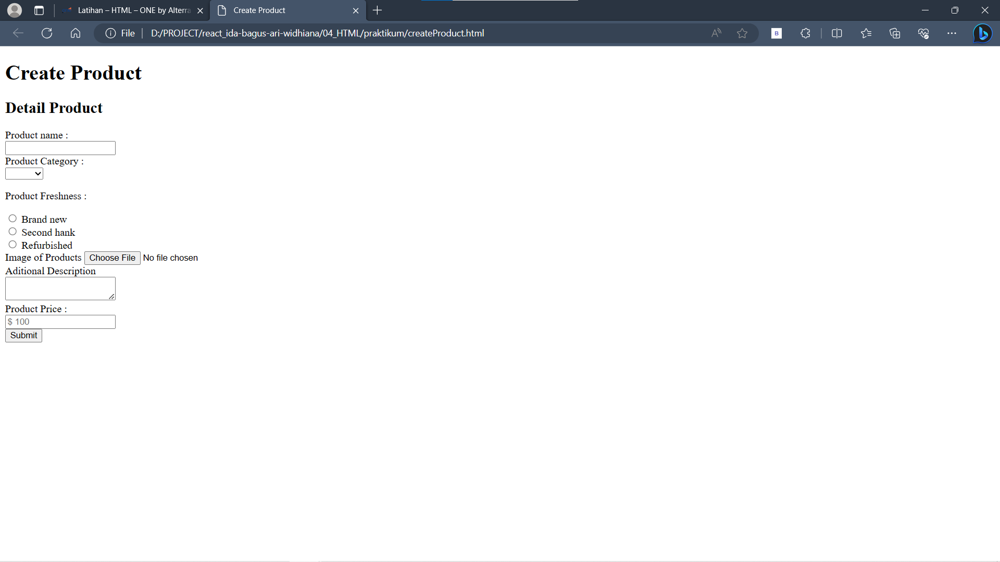
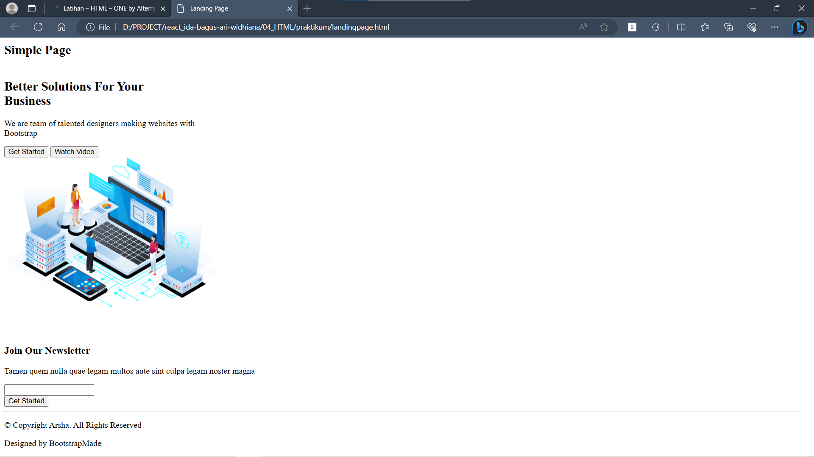
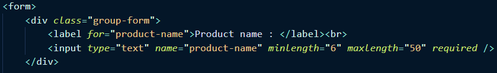
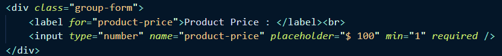
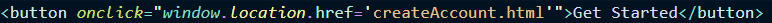

## RESUME Materi KMReact - HTML

Poin penting yang dapat dipelajarin dari materi HTML adalah

#### 1. Pengertian HTML

HTML (Hypertext Markup Language) adalah sebuah standar yang digunakan secara luas untuk menampilkan halaman web.

#### 2. Kegunaan HTML

Kegunaan dari HTML antara lain:

- Membuat struktur dari halaman website.
- Mengatur tampilan dan isi dari halaman web.
- Membuat tabel dengan tag HTML table.
- Membuat form HTML.
- Membuat gambar dengan canvas.
- Mempublikasikan halaman website secara online.

#### 3. Struktur dasar HTML

- '<!DOCTYPE html>' = digunakan untuk mendefinisikan dokumen sebagai HTML5
- '<html>' = digunakan sebagai elemen root dari halaman HTML
- '<head>' = berisi informasi meta tentang dokumen
- '<title>' = menentukan judul untuk dokumen
- '<body>' = berisi konten halaman yang terlihat

Struktur halaman:

    <!DOCTYPE html>
        <html>
        <head>
            <title>Title</title>
        </head>
        <body>
            Content HTML
        </body>
        </html>

## Task

#### Soal Prioritas 1

Membuat sebuah halaman Create Product sesuai struktur yang telah diberikan 

#### Soal Prioritas 2

Membuat sebuah halaman Landing Page sesuai struktur yang telah diberikan 

#### Soal Eksplorasi

1. Lakukan validasi "required" pada setiap form
2. Terapkan standar validasi:

- form product Product Name mempunyai minimal 6 huruf dan maksimal 50 huruf 
  
- Product Price harus berupa angka 
  

3. Sambungkan halaman landingPage dengan CreateAccount 
   
