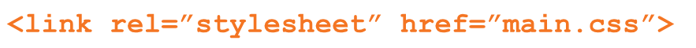
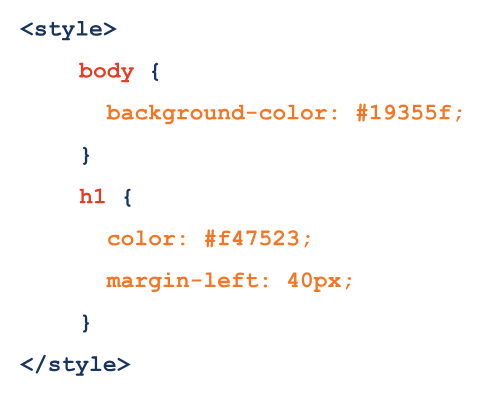
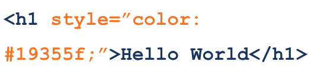
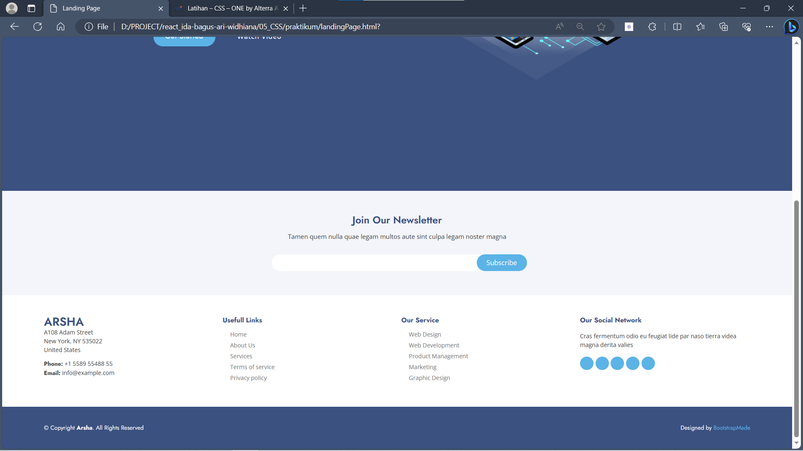
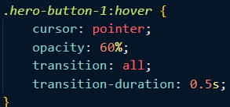
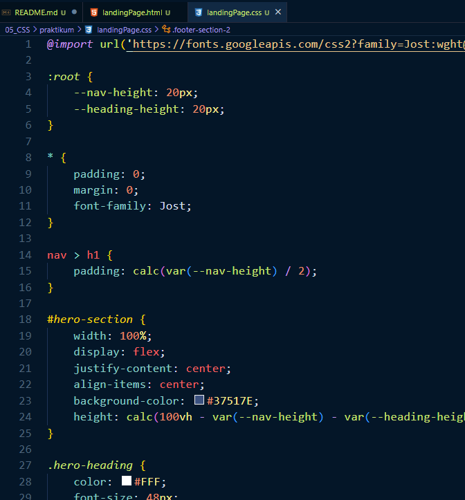
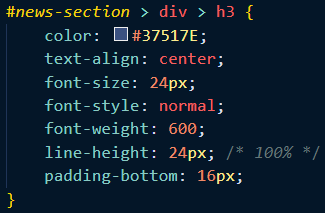
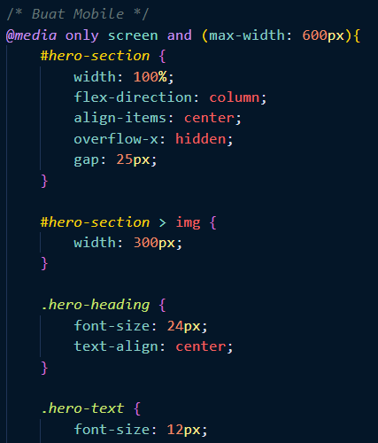
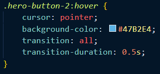

# Materi CSS

## Resume Materi KMReact - CSS

Poin penting yang dapat dipelajarin dari materi CSS adalah

#### 1. Pengertian CSS

CSS (Cascading Style Sheets) adalah sebuah aturan styling yang dapat menghias halaman web (color, size, font, background, width, height, dll). Selain itu, CSS juga dapat mengatur posisi atau layout pada halaman web (float, align, display, position, dll).

#### 2. Cara menambahkan file CSS ke dalam HTML

Ada 3 cara dalam menambahkan file CSS ke dalam HTML:

- External CSS, disisipkan ke dalam tag <head> pada HTML. Ekstensi file CSS adalah .css 
  
- Internal CSS, dapat digunakan di dalam satu file HTML. Didefinisikan di dalam elemen <style>, di dalam bagian <head> atau di dalam bagian <body> 
  
- Inline CSS, dapat digunakan untuk elemen tunggal pada HTML, diproritaskan untuk menerapkan style yang unik 
  

#### 3. Syntax dalam CSS

Contoh: h1 { color: white; font-size: 30px; }

- h1, sebagai sebuah Selector dan berfungsi untuk memilih suatu elemen yang ingin diberi styling.
- color & font-size, sebagai sebuah property untuk mengatur styling pada elemen yang dipilih.
- white & 30px, sebagai sebuah value atau nilai yang digunakan untuk styling elemen.

#### 4. CSS Selector

Penanda HTML ke dalam CSS. Dapat menggunakan selector ID dan Class.

1. ID = (#)

- Setia
- p elemen hanya dapat memiliki satu tag id
- Dalam satu halaman tidak boleh ada dua penamaan id yang berbeda

2. Class = (.)

- Tag class dengan nama yang sama dapat dipakai berulang - ulang pada satu halaman
- Satu elemen boleh memiliki lebih dari satu Class yang berbeda - beda

---

## Task CSS

#### Soal Prioritas 1

- Membuat halaman body dan footer di file landingPage.html menjadi seperti yang telah ditentukan. 
   
  

#### Soal Prioritas 2

- Pada halaman landingPage.html implementasikan efek hover pada form input atau elemen lain sesuai keinginan. 
  
- Gunakan CSS pada external file dan implementasikan selection class CSS pada element HTML. 
  
- Terapkan CSS Specifity untuk selector element HTML dengan id, tag, class dll. seperti #header h1 > h1. 
  

#### Soal Eksplorasi

- Buat halaman menjadi responsive untuk halaman landingPage.html dengan media query pure CSS. 
   
  
- Terapkan efek transisi background, warna atau posisi di halaman landingPage.html. 
  
