# Materi Bootstrap

## Resume Materi KMReact - Bootstrap

Poin penting yang dapat dipelajarin dari materi Bootstrap adalah

#### 1. Pengertian Front End Framework

Front End Framework adalah sekumpulan aturan kode yang bisa digunakan untuk mempermudah dalam membuat suatu tampilan website. Contoh dari Front End Framework adalah Bootstrap, Material UI, Semantic UI, dan lain sebagainya.

#### 2. Alasan mengapa Bootstrap sering digunakan

- Gratis
- Mudah untuk dipelajari
- Cepat
- Mendukung dalam pembuatan website yang responsive

#### 3. Penggunaan Bootstrap

Bootstrap dapat digunakan secara langsung dengan mengakses website Bootstrap, kemudian install melalui Package Manager maupun menggunakan CDN. Dalam Bootstrap terdapat beberapa class yang dapat membantu untuk membuat tampilan website menjadi lebih rapi dan menarik. Class tersebut antara lain Container, Row, Column, Button, dan lain sebagainya.

---

## Task

Bootstrap menggunakan CDN
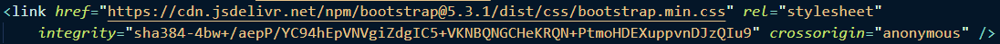 
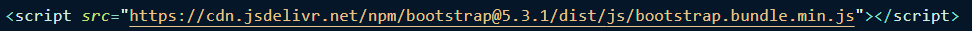

#### Soal Prioritas 1

- Gunakan komponen Bootstrap seperti Navbar untuk membuat navigation di landingPage.html 
  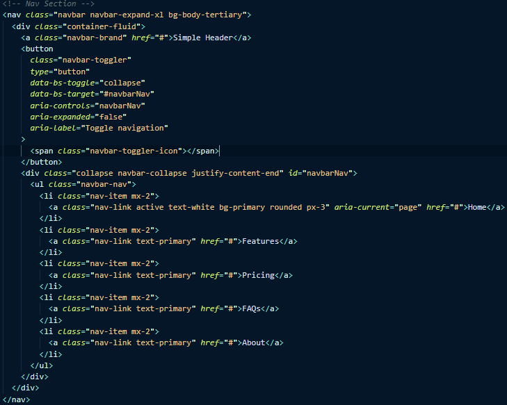 
  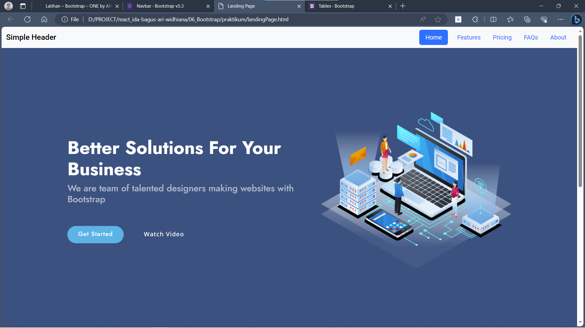
- Gunakan komponen Bootstrap seperti button dan form di halaman createProduct.html 
  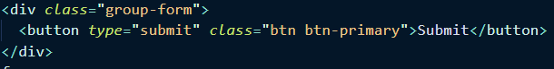 
  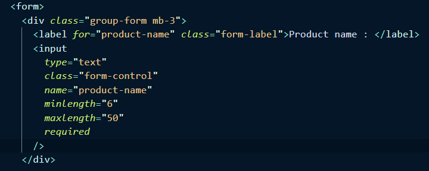
- Buatlah halaman createProduct.html seperti yang ditentukan sebelumnya 
  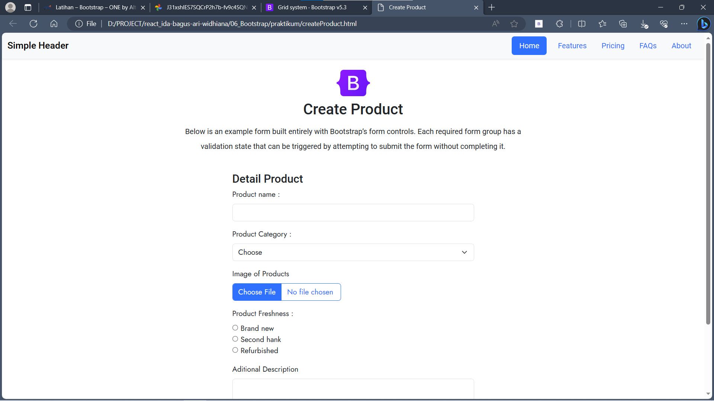

#### Soal Prioritas 2

- Gunakan grid system dari BS ketika membuat createProduct.html 
  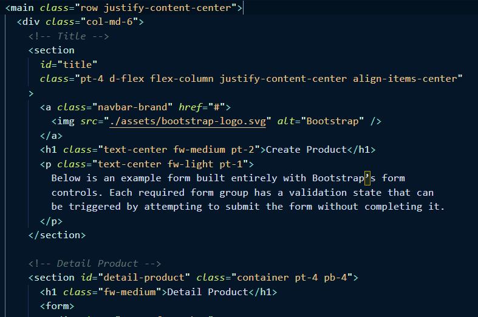
- Buatlah halaman memiliki validasi memanfaatkan BS 
  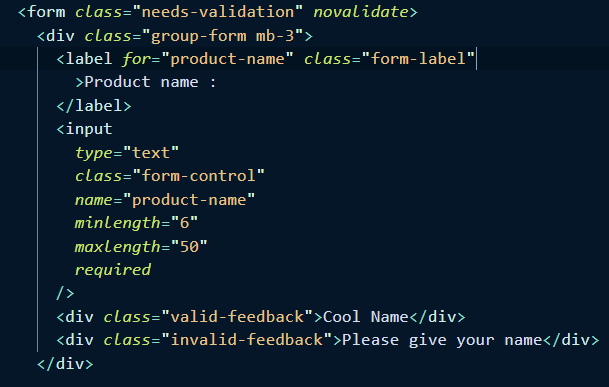 
  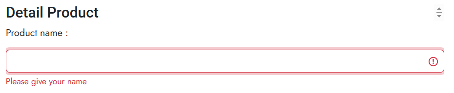 
  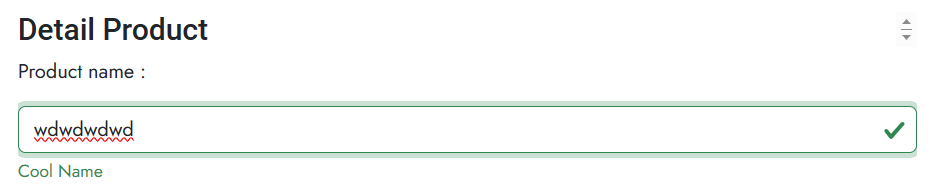

#### Soal Eksplorasi

- Terapkan Javascript Plugin di Bootstrap seperti Modal, Carousel, atau Tooltip di halaman createProduct.html/landingPage.html
  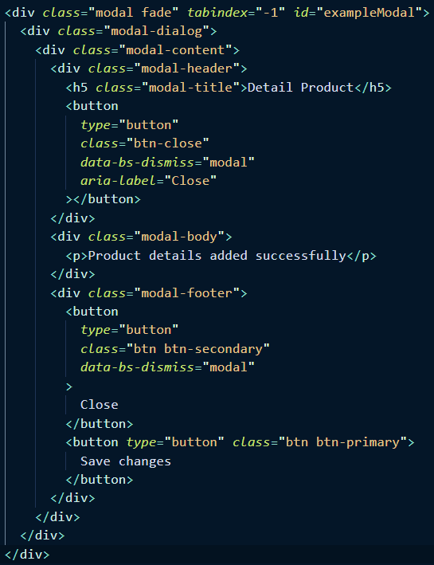 
  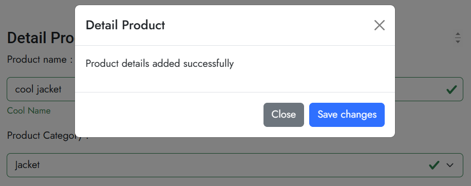
- Buat alert dengan bootstrap ketika validasi input form di CreateAccount.html salah
  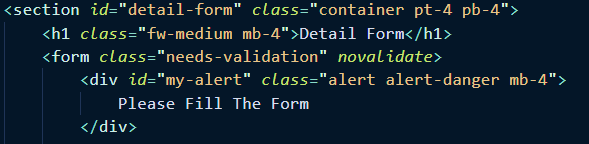 
  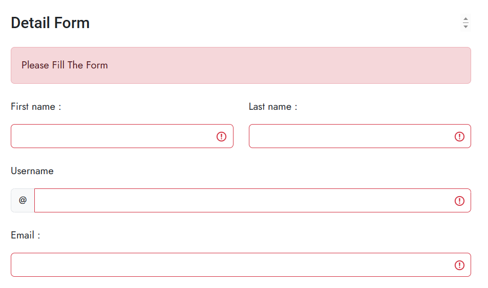
