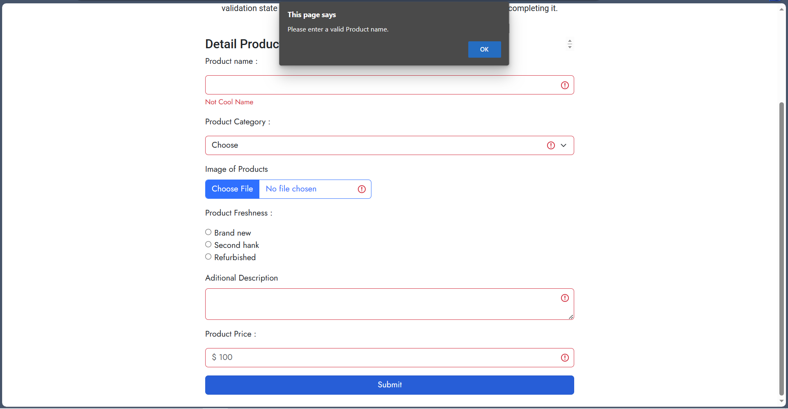
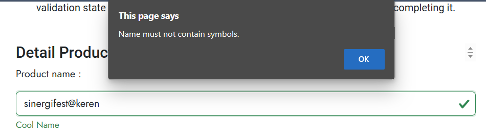

# Materi Javascript Refreshment

## Resume Materi KMReact - Javascript Refreshment

Poin penting yang dapat dipelajarin dari materi Javascript Refreshment adalah

#### 1. Pengertian Javascript

Javascript merupakan Bahasa Pemrograman yang High-level, Scripting, Untyped, dan Interpreted. Javascript merupakan bahasa tingkat tinggi yang dapat dimengerti oleh manusia. Javascript dibuat untuk berinteraksi dengan halaman web, apapun web browser yang digunakan dapat menjalankan bahasa Javascript. Javascript tidak berpengaruh pada tipe data. Javascript juga bahasa yang fleksibel, mudah untuk diuji dan memiliki berbagai framework seperti react, vue, angular, dan lain sebagainya.

#### 2. Declaration pada Javascript

Declaration merupakan sebuah proses pembuatan variabel untuk menyimpan data. Dalam Javascript terdapat 3 Jenis Varibel, yaitu Var, Let dan Const.

- Var, merupakan variabel yang dapat di re-assignment. Variabel ini ketika di re-declaration maka akan menghasilkan undifined. Var juga bersifat hoisted atau dapat digunakan bahkan sebelum dideklarasikan.
- Let, merupakan variabel yang dapat di re-assigment, namun ketika di re-declaration maka akan menghasilkan error. Let bersifat tidak hoisted atau tidak dapat digunakan bahkan sebelum dideklarasikan.
- Const, merupakan variabel yang tidak dapat di re-assigment dan ketika di re-declaration menghasilkan error. Const bersifat tidak hoisted atau tidak dapat digunakan bahkan sebelum dideklarasikan.

#### 3. Method pada Javascript

Method merupakan sebuah fungsi yang terkait dengan object, dapat membuat programnya se-sederhana mungkin sesuai kegunaan masing - masing. Dalam Javascript terdapat beberapa method yaitu:

- length, digunakan untuk mengetahui panjang dari array.
- toString, digunakan untuk mengkonversi array menjadi string nilai array (dipisahkan dengan koma).
- pop, digunakan untuk menghilangkan elemen terakhir pada array.
- push, digunakan untuk menambahkan elemen pada array (elemen terakhir).
- shift, digunakan untuk menghilangkan elemen pertama array.
- unshift, digunakan untuk menambahkan elemen pada array (elemen awal).
- concat, digunakan untuk menggabungkan dua atau lebih array dan mengembalikan salinan array yang digabungkan.
- map, digunakan untuk membuat array baru dengan hasil memanggil fungsi untuk setiap elemen array.
- foreach, digunakan untuk memanggil fungsi untuk setiap elemen array.
- slice, digunakan untuk memilih bagian dari array, dan mengembalikan array baru.
- splice, digunakan untuk menambahkan item pada array
- filter, digunakan untuk membuat array baru dengan setiap elemen dalam array yang lulus seleksi.
- reduce, digunakan untuk melakukan operasi pada setiap elemen array menjadi nilai tunggal (dari kiri ke kanan).

#### 4. DOM (Document Object Model)

Document Object Model adalah API untuk HTML yang merepresentasikan halaman website pada suatu dokumen menjadi sebuah object.
Selection Method:

- getElementById(), digunakan untuk Element
- getElementByTagName(), digunakan untuk HTMLCollection
- getElementByClassName(), digunakan untuk HTMLCollection
- querySelector(), digunakan untuk Element
- querySelectorAll(), digunakan untuk nodeList

DOM Manipulation:

- element.innerHTML, digunakan untuk merubah isi dari tag yang sudah diseleksi.
- element.style.<propertyCSS>, digunakan untuk merubah style dari tag yang sudah diseleksi.
- element.setAttribute(), digunakan untuk mengelola / manipulasi attribute yang sudah diseleksi.
- element.classList.add(), digunakan untuk mengelola / manipulasi class yang sudah diseleksi

DOM Event:

- onclick, digunakan ketika pengguna mengklik mouse.
- onchange, digunakan dalam kombinasi dengan validasi bidang input.
- onblur, digunakan ketika meninggalkan kolom input.
- onmouseover, digunakan ketika pengguna mengarahkan mouse ke atas pada suatu object.
- onmouseout, digunakan ketika pengguna mengarahkan mouse ke keluar pada suatu object.
- oncopy, digunakan ketika pengguna mengcopy suatu object.

---

## Task

#### Soal Prioritas 1

Pada halaman CreateProduct.html tangkap data pada form input Product Name tambahkan dengan JS DOM dan lakukan validasi seperti berikut :

- Product Name tidak boleh melebihi 25 karakter
  
- Jika Product Name melebihi 10 karakter tampilkan pesan error atau peringatan/alert seperi "Last Name must not exceed 25 characters."
  
- Product Name dan Product Price tidak boleh kosong. Jika field tersebut kosong saat tombol Submit/Create Product di tekan maka tampilkan alert atau error bahwa field tersebut tidak boleh kosong. Misal "Please enter a valid Product name.".
  Product Name Field Kosong: 
   
  Product Price Field Kosong: 
  

#### Soal Prioritas 2

Pada halaman CreateProduct.html tangkap data pada form input tambahkan dengan JS DOM dan lakukan validasi seperti berikut :

- Product Name tidak boleh mengandung karakter seperti @/#{}
  
- Jika Product Name mengandung symbol @/#{} tampilkan pesan error atau peringatan misal "Name must not contain symbols."
  
- Validasi input setiap form bahwa field tidak boleh kosong. Jika field kosong saat form dikirim maka tampilkan pesan error “The xxx field must be filled in”
  Menggunakan contoh pada Image Field yang kosong: 
  

#### Soal Eksplorasi

Pada halaman CreateProduct.html tangkap data pada form yang telah dibuat kemudian tambahkan dengan JS DOM dan lakukan validasi seperti berikut :

- Buatlah script DOM JavaScript untuk menonaktifkan tombol Submit/Create Account jika salah satu input tidak valid/salah/belum di isi.
  
- Jika salah satu field tidak valid/salah berikan border merah atau tampilkan icon error pada field tersebut dengan JS DOM.
  
- Jika semua form telah diisi sesuai dengan validasi dan user melakukan klik pada button Submit maka akan terdapat alert yang mengeluarkan setiap data.
  
