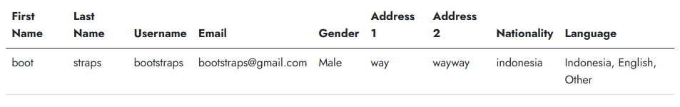
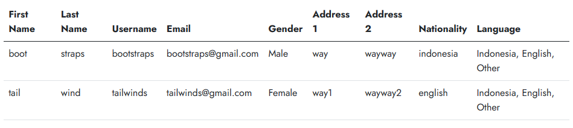
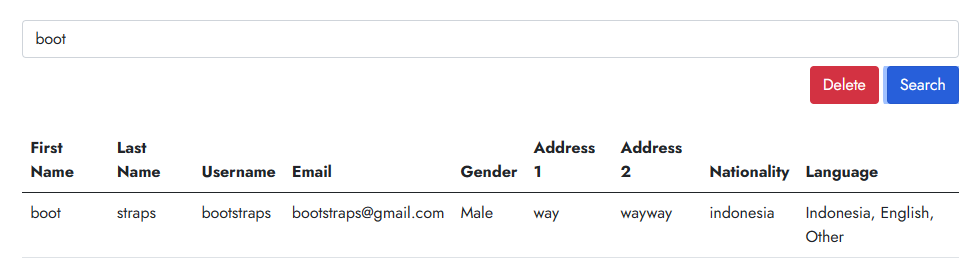

# Materi Introduction Data Structure

## Resume Materi KMReact - Introduction Data Structure

Poin penting yang dapat dipelajarin dari materi Introduction Data Structure adalah

#### 1. Pengertian Data Structure

Data merupakan cakupan luas merujuk pada semua tipe informasi yang tersimpan dalam memori komputer (string, number, boolean, dll).
Data Structure sendiri merupaka bagaimana menyimpan dan mengorganisir data/value/elemen di dalam memori komputer. Data tersebut dapat dikelola dengan berbagai cara.
Alasan mengapa belajar Data Structure adalah agar kita dapat mengerti kualitas kode yang dibuat serta efisiensi dari kode.

#### 2. Operasi Data Structure

Dalam Javascript terdapat 4 operasi Data Structure, yaitu Read, Search, Insert, dan Delete.

- Reading = melihat nilai yang terkandung pada indeks tertentu. Operasi ini efisien dan merupakan jenis operasi tercepat karena hanya membutuhkan 1 steps. Ketika membaca sebuah value atau nilai pada indeks tertentu memori komputer dapat langsung melompat ke indeks tersebut, karena komputer bisa melompat ke alamat memori manapun dalam satu steps.
- Searching = mencari apakah nilai tertentu ada atau tidak. Ketika melakukan operasi searching, komputer tidak memiliki cara untuk melompat langsung ke nilai tertentu sehingga komputer tidak mengetahui begitu saja mengenai nilai yang terkandung pada setiap memori. Operasi ini kurang efisien dibanding reading dan membutuhkan banyak steps sesuai ukuran memori.
- Insertion = Efisiensi operasi ini tergantung dimana kita memasukkan valuenya. Jika memasukan value pada bagian akhir maka hanya membutuhkan 1 steps. Jika memasukkan value baru di awal atau tengah maka perlu menggeser data yang sudah ada, sehingga membutuhkan steps tambahan.
- Deletion = Operasi ini digunakan untuk menghilangkan value pada indeks tertentu. Membutuhkan jumlah N steps untuk memori yang mengandung N data.

#### 3. Basic Data Structure

Dalam Data Stucture, menganalisa jumlah steps adalah sangat penting untuk mengetahui performa dari sebuah data structure di suatu aplikasi. Reading, Searching, dan Deletion memiliki efissiensi yang sama yaitu secara berurutan 1 steps, N steps dan N steps. Terdapat perbedaan pada operasi Insertion, dimana skenario terbaik yaitu 1 steps pada array dan N + 1 steps pada set.
Perbedaan menggunakan set dan array adalah jika data structure yang ingin dibuat terbebas dari duplikasi (duplikat value) maka gunakan set, meskipun pada operasi insertion lebih lambat. Jika tidak membutuhkan pemeriksaan duplikasi, dapat menggunakan array.

---

## Task

#### Soal Prioritas 1

- Masukkan setiap data yang telah berhasil di validasi ke dalam tabel. (Read).
  

#### Soal Prioritas 2

- Jumlah dari data akan selalu bertambah jika user terus mengisi form yang telah kalian buat. (Insert)
  

#### Soal Eksplorasi

- Buatlah tombol deletion(Delete) berfungsi. tombol deletion akan selalu menghapus nilai terakhir yang di masukkan oleh user. (Delete).
  

- Buatlah tombol search berfungsi. tombol search akan mencari data dan menampilkan datanya pada alert berdasarkan username. (Search).
  
