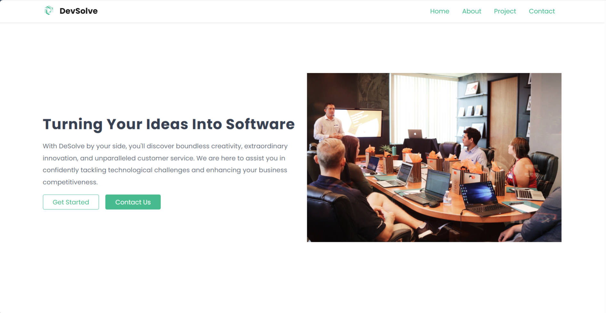
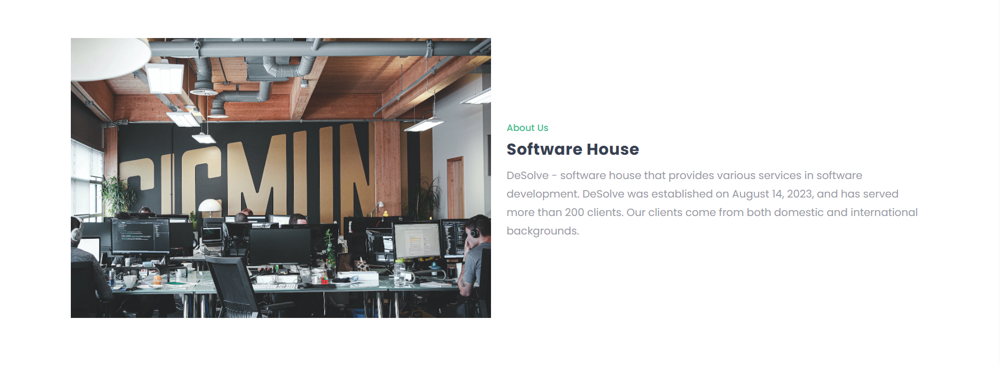
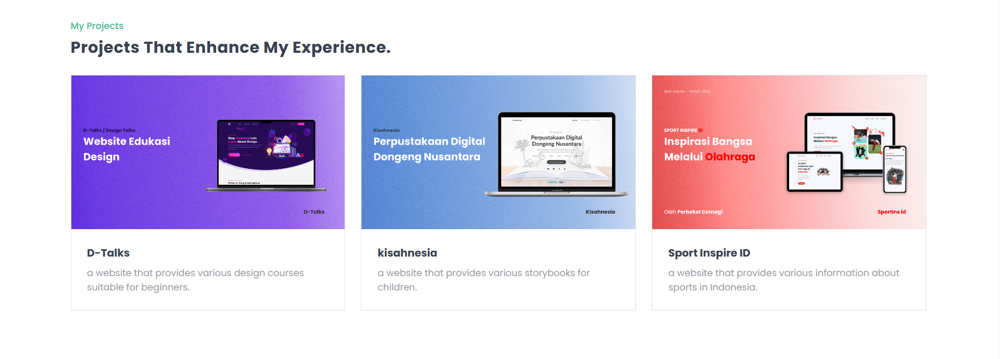
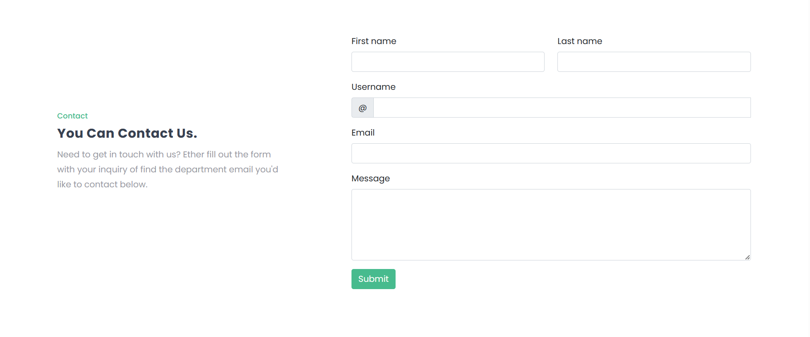
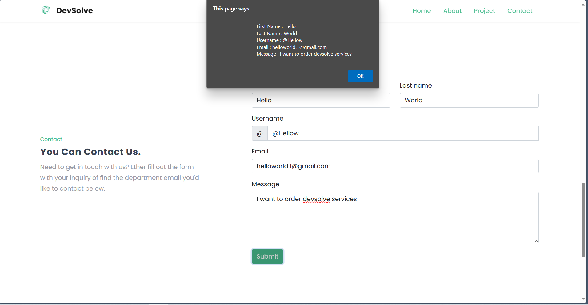
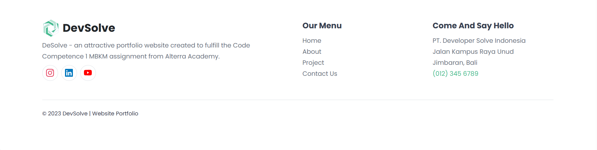

# Code Competence KMReact 1

## Penjelasan & Screenshoot

Pembuatan sebuah halaman menggunakan HTML, CSS/Framework CSS, dan JS. halaman ini berada pada satu index.html sehingga tidak perlu melakukan routing.  

Saya membuat sebuah website yang menyediakan jasa pembuatan software atau software house yang bernama DevSolve.

---

#### 1. Header & Hero

- Pada bagian ini berisi header dan hero section. Pada header terdapat navigation bar yang dihubungkan ke menu - menu yang ada di website DevSolve. Pada hero section terdapat gambar dan juga kata - kata yang dapat menarik user.
  

#### 2. About

- Pada bagian ini berisi about section atau pengenalan singkat website DevSolve.
  

#### 3. Project

- Pada bagian ini berisi project section atau project yang pernah dikerjakan oleh software developer DevSolve.
  

#### 4. Contact

- Pada bagian ini berisi contact section atau contact person dari DevSolve.
  

- Apabila User mengirimkan sebuah pesan, maka akan ada alert atau pemberitahuan yang akan menampilkan data yang User kirimkan.
  

#### 5. Footer

- Pada Footer section terdapat link social media dari DevSolve, nama website DevSolve beserta logo dan juga nomor telepon serta alamat dari DevSolve.
  
