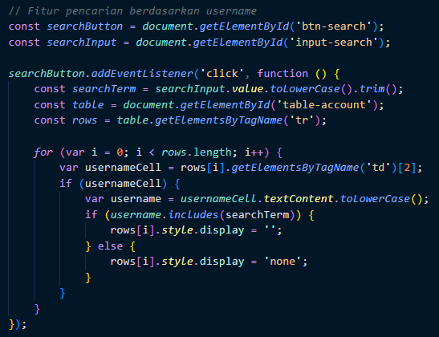
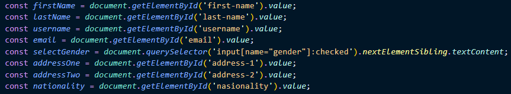
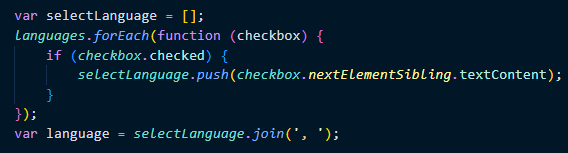
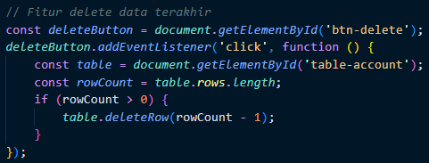
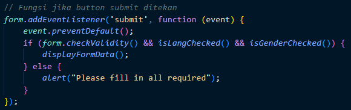
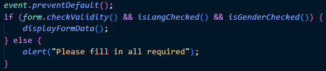
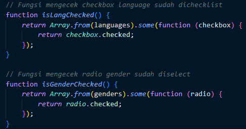

# Materi Clean Code

## Resume Materi KMReact - Clean Code

Poin penting yang dapat dipelajarin dari materi Clean Code adalah

#### 1. Pengertian Clean Code

Clean Code adalah sebuah istilah untuk kode yang mudah dibaca, dipahami dan diubah oleh programmer.
Kenapa menggunakan Clean Code, karena

- Work Collaboration. Agar code yang kita buat dapat dipahami oleh orang lain.
- Feature Development. Mengetahui fungsi fitur yang dibuat
- Faster Development. Ketika kita memahami code yang dibuat maka akan mempercepat pekerjaan dalam pembuatan suatu aplikasi atau program.

#### 2. Karakteristik Clean Code

1. **_Mudah dipahami_**

```
// Contoh penamaan variabel yang sulit dipahami
const loc = ['Austin', 'New York' 'San Fransico'];

// Contoh penamaan variabel yang mudah dipahami
const locations = ['Austin', 'New York' 'San Fransico'];
```

2. **_Mudah dieja dan dicari_**

```
// Sulit untuk dieja dan dicari
let fname = "Rangga";
let dvd = 4;

// Lebih mudah dieja dan dicari
let fullName = "Rangga";
let divider = 4;
```

3. **_Singkat namun mendeskripsikan konteks_**

```
let result = 0;
console.log(result+1);
console.log(result+2);
console.log(result+3);

// Versi lebih singkat dapat menggunakan looping
for(i = 1; i <= 3; i++>){
  console.log(result + i);
}
```

4. **_Konsisten_**

```
CONST DAYS_IN_WEEK = 7;
CONST daysInMonth = 30;

// Konsisten
CONST DAYS_IN_WEEK = 7;
CONST DAYS_IN_WEEK = 30;
```

5. **_Hindari penambahan konteks yang tidak perlu_**

```
let fullNameString;

// Lebih singkat sesuai konteks
let fullName;
```

6. **_Memberikan comment_**
7. **_Menggunakan function yang baik_**
8. **_Gunakan Konvensi_** seperti style guide dari airbnb untuk bahasa javascript dan google python untuk bahasa python
9. **_Formatting_**. Terdapat beberapa saran formating seperti:

- Lebar baris code 80 - 120 karakter.
- Satu class 300 - 500 baris
- Baris code yang berhubungan dan saling berdekatan
- Dekatkan fungsi dengan pemanggilnya
- Deklarasi variabel berdekatan dengan penggunaannya
- Perhatikan indentasi
- Menggunakan _prettier_ atau _formatter_

#### 3. Clean Code Principle

Terdapat prinsip clean code yang sering digunakan, yaitu:
KISS (Keep It So Simple), artinya hindari membuat fungsi yang dibuat untuk melakukan A, sekaligus memodifikasi B, mengecek fungsi C, dan seterusnya.
Tips untuk menggunakan KISS:

- Fungsi atau class harus kecil.
- Fungsi diuat untuk melakukan satu tugas saja.
- Jangan gunakan terlalu banyak argumen pada fungsi.
- Harus diperhatikan untuk mencapai kondisi yang seimbang, kecil dan jumlahnya minimal.

Ada juga DRY (Don't Repeat Yourself) yang berarti menghindari duplikasi code dengan membuat fungsi yang dapat digunakan secara berulang - ulang.

Untuk mencapai prinsip KISS dan DRY, dapat dilakukan sebuah proses yang bernama Refactoring. Refactoring merupakan sebuah proses restrukturisasi kode yang dibuat, dengan cara mengubah struktur internal tanpa mengubah perilaku eksternal.

Teknik Refactoring:

- Membuat sebuah abstraksi.
- Memecah kode dengan fungsi/class
- Perbaiki penamaan dan lokasi kode
- Deteksi kode yang memiliki duplikasi

---

## Task

#### Soal Prioritas 1

Terapkan clean code terkait hal berikut

- Kemudahan baca: Kode harus mudah dibaca, dipahami, dan dipelihara, dengan menggunakan nama variabel yang bermakna dan komentar di tempat yang diperlukan.
  
- Konsistensi: Kode harus mengikuti konvensi nama yang konsisten dan gaya pengkodean sepanjang proyek.
  

#### Soal Prioritas 2

Terapkan clean code terkait hal berikut

- Simpel: Kode harus sesederhana mungkin, menghindari logika kompleks dan kode yang tidak perlu.
  
- Efisiensi: Kode harus dioptimalkan untuk performa dan menghindari perhitungan atau operasi yang tidak perlu.
  

#### Soal Eksplorasi

Terapkan clean code 100% pada setiap aspek dan menerapkan hal berikut

- Kemudahan uji: Kode harus mudah diuji dan harus meliputi tes otomatis untuk memvalidasi fungsinya.
  
- Penanganan error: Kode harus memiliki mekanisme penanganan error yang tepat untuk menangani pengecualian dan masukan yang tidak terduga.
  
- Dokumentasi: Kode harus mencakup dokumentasi dan komentar yang relevan untuk membantu memahami tujuan dan fungsionalitas kode.
  
