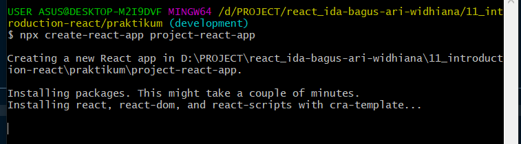
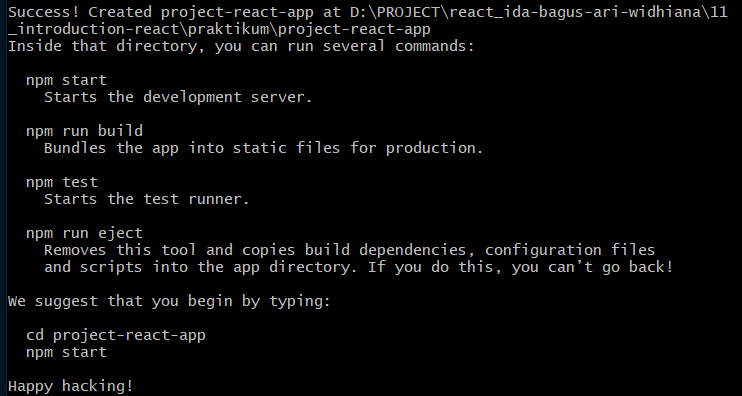
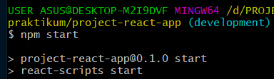
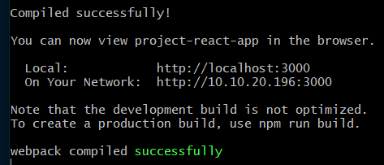
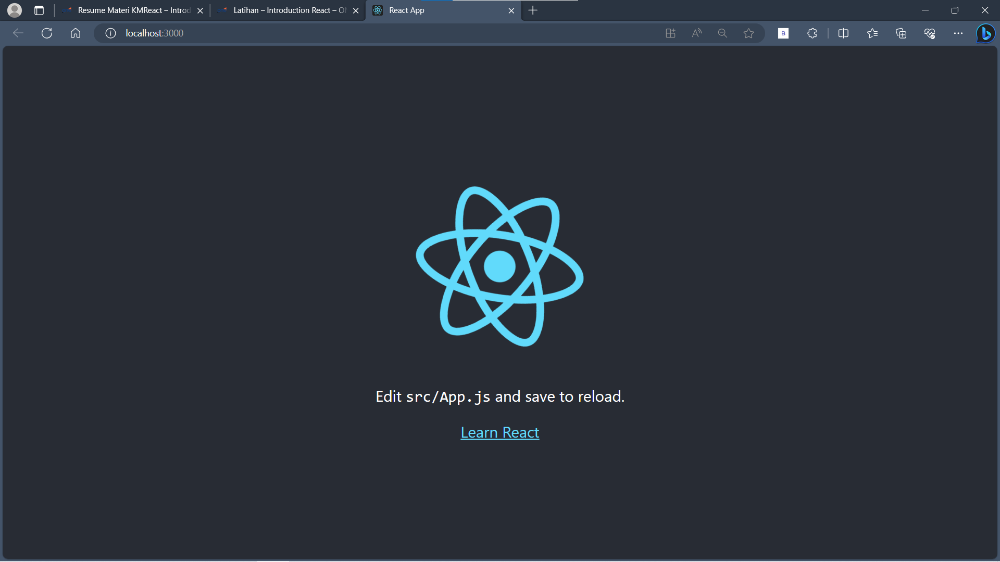
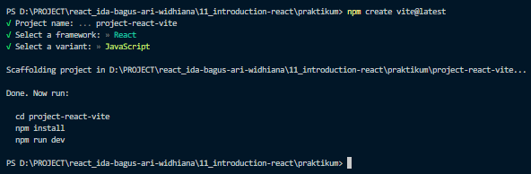
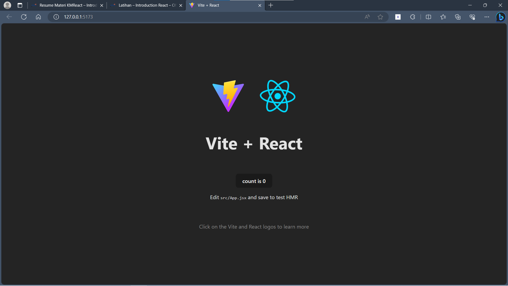

# Materi Introduction React

## Resume Materi KMReact - Introduction React

Poin penting yang dapat dipelajarin dari materi Introduction React adalah

#### 1. Pengertian React

React merupakan Library Javasctipt untuk membuat User Interface (UI) yang interaktif dan cepat pada web maupun mobile. Pada arsitektur MVC (Model-View-Controller), React JS hanya akan mengambil peran pada layer View saja. Contoh Library dan Framework untuk membuat UI adalah seperti Jquery, React, Angular, Vue, Next, dan lain - lain.

Cara menginstall React

1. install node.js terlebih dahulu.
2. kemudian buka command line dan ketik "npx create-react-app [nama project]".
3. setelah itu akan dijalankan penginstalan react beserta depedency.

#### 2. Alasan menggunakan React

- Deklaratif, artinya sebuah pendekatan yang berfokus pada goals atau tujuan yang ingin dicapai.
- Berbasis pada komponen, artinya react memisahkan UI menjadi beberapa bagian kecil yang biasa disebut sebagai komponen.
- Belajar sekali, tulis dimana saja, artinya react dapat juga digunakan di ios dan android.
- Teknologi yang popular, artinya react banyak didownload dibandingkan framework seperti vue, angular dan sebagainya.
- Sudah teruji, artinya react sudah banyak dipakai pada aplikasi yang cukup besar seperti instagram, facebook, netflix dan sebagainya.

#### 3. Virtual DOM

Merupakan representasi dari UI berbentuk Javascript Object yang disimpan pada memori.
Masalah yang dihadapi denga DOM manipulation:

1. DOM manipulation secara manual dapat membuat code berantakan.
2. Sulit untuk mengingat DOM state sebelumnnya.
3. Jauh lebih lambat daripada operasi javascript pada umumnya.

---

## Task

#### Soal Prioritas 1

- Lakukan Installation react menggunakan CRA (Create React App)

  1. Melakukan penginstalan pada command line "npx create-react-app project-react-app".
     
  2. React berhasil diinstall.
     

#### Soal Prioritas 2

- Jalankan react pada local
  1. Jalankan react pada local dengan ketik command "npm start" pada command line. Hal tersebut untuk melakukan start development react.
     
  2. Jika sudah dijalankan maka dapat membuka react pada localhost.
     
  3. Tampilan react pada localhost.
     

#### Soal Eksplorasi

- Buatlah project react menggunakan vite.

  1. Lakukan penginstalan react vite pada command line "npm create vite" atau "npm create vite@latest".
  2. Kemudian kita akan disuruh untuk memberi nama project react-vite nya, framework yang akan digunakan serta variant yang akan digunakan.
  3. setelah itu lakukan "npm install" untuk menginstall package dan depedency yang ada.
     

- Jalankan pada local

  1. Jalankan react-vite pada local dengan ketik command "npm run dev" pada command line.
  2. Setelah dijalankan maka dapat membuka react-vite pada localhost.
     
