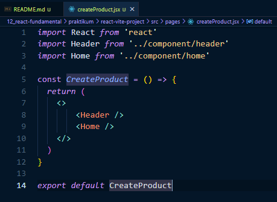
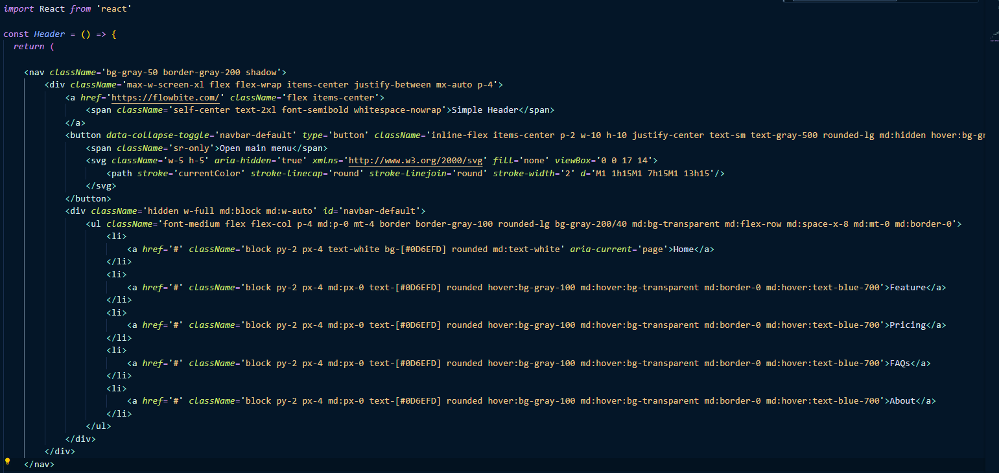
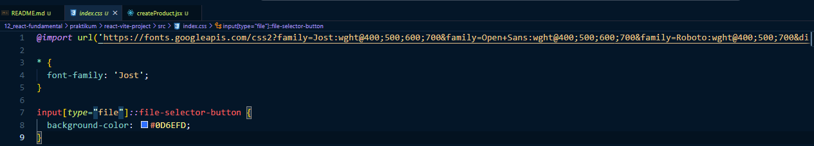
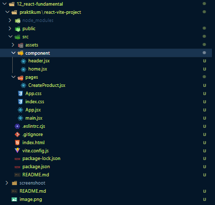

# Materi React Fundamental

## Resume Materi KMReact - React Fundamental

Poin penting yang dapat dipelajarin dari materi Introduction React adalah

#### 1. Pengertian JSX

JSX merupakan singkatan dari Javascript XML. JSX juga merupakan eksistensi pada javascript. JSX dibuat berdasarkan fakta kalau logika rendering sangat terikat dengan logic UI. Kita tak harus menggunakan JSX, akan tetapi JSX memudahkan kita untuk menulis dalam aplikasi React.
Spesifikasi jenis pada elemen react berupa kapitalisasi untuk komponen react, huruf kecil untuk komponen bawaan.

```
<!-- Komponen React -->
<MyButton>Klik Saya</Button>

<!-- Komponen Bawaan -->
<h1>Halo, Dunia</h1>
```

Untuk menaruh ekspresi JS yang valid pada JSX dapat menggunakan kurung kurawal.

```
const name = 'ari widhiana'
const element = <h1>my name is {name}</h1>
```

#### 2. Komponen React dan Props

Komponen React merupakan bagian kode yang dapat digunakan kembali untuk menentukan tampilan, behavior dan state sebagian UI. Dalam komponen terdapat istilah seperti Props

Props:

- singkatan dari properties yang membuat kita dapat memberikan argumen atau data pada component.
- Props membantu untuk membuat komponen menjadi lebih dinamis.
- Props dioper ke component sama seperti memberikan atribut pada tag HTML.
- Props pada component adalah read-only dan tidak dapat diubah.

#### 3. LifeCycle

Lifecycle method yang paling umum:

1. render()

   - Fungsi yang paling sering dipakai
   - Required pada class component
   - Pure Function. Tidak boleh ada setState()

2. componentDidMount()

   - Dipanggil ketika component sudah di render pertama kali.
   - Tempat yang tepat untuk pemanggilan API
   - Boleh ada setState()

3. componentDidUpdate()

   - Dipanggil ketika terjadi update (props atau state berubah)

4. componentWillMount()
   - Dipanggil ketika component akan dihancurkan
   - Cocok untuk clean up actions

---

## Task

#### Soal Prioritas 1

1. Ubahlah halaman CreateProduct.html dari project yang sudah anda buat menjadi komponen ReactJS.
2. Gunakan JSX (JavaScript XML) untuk mengubah HTML kedalam ReactJS. kalian dapat menggunakan tools seperti : https://transform.tools/html-to-jsx
   

#### Soal Prioritas 2

1. Hubungkan CSS dan JS yang kalian gunakan pada halaman CreateProduct.html sehingga tampilan dapat bekerja dengan baik.
   Disini saya menggunakan framework CSS yaitu TailwindCSS serta menggunakan library component berupa flowbite.<br>
   
   Namun saya juga menggunakan CSS untuk mengimport font serta mengubah warna button dari element input file.<br>
   

#### Soal Eksplorasi

1. Buatlah komponen-komponen ReactJS yang membagi halaman CreateProduct.html menjadi lebih kecil seperti header dan footer
   
