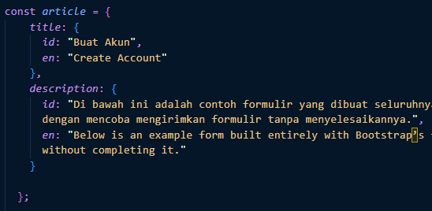

# Materi Event Handling

## Resume Materi KMReact - Event Handling

Poin penting yang dapat dipelajarin dari materi Event Handling adalah

#### 1. Pengertian State

State adalah data private sebuah component. Data ini hanya tersedia untuk component tersebut dan tidak bisa diakses dari component lain.

- Data yang bisa dimodifikasi menggunakan setState
- Setiap terjadi modifikasi akan terjadi render ulang
- Bersifat Asynchronous
- Dipakai dalam class

Perbedaan Props dan State:

- **Props** hanya bisa dibaca sedangkan **State** bisa diubah secara asynchronous
- **Props** tidak bisa dimodifikasi sedangkan **State** bisa dimodifikasi dengan this.setState.

#### 2. Statefull dan Stateless

Statefull component adalah memiliki state. Component ini dibuat dengan menggunakan class. Kelebihan dari class component ini adalah memiliki lifecycle.
Stateless component adalah tidak memiliki state tapi hanya props. Umumnya component ini dibuat dengan function karena codenya lebih ringkas.

Kedua class component tersebut memiliki nama berbeda juga seperti:

- Smart Component & Dump Component
- Container Component & Presentational Component

Perbedaan Component Statefull dan Component Stateless

- Statefull mengerti tentang aplikasi sedangkan stateless tidak tahu tentang aplikasi.
- Statefull melakukan data fetching (pengambilan data) sedangkan stateless tidak melakukan data fetching (pengambilan data).
- Statefull berinteraksi dengan aplikasi sedangkan stateless tujuan utamanya adalah visualisasi.
- Statefull tidak dapat digunakan kembali sedangkan stateless dapat digunakan kembali.
- Statefull meneruskan status dan data ke child sedangkan stateless hanya berkomunikasi dengan parent.

#### 3. Handling EVent

Handling Event merupakan suatu metode untuk menangani sebuah event / aksi yang diberikan pengguna kepada suatu komponen.
Beberapa contoh list Event:

- Clipboard Events (Promise terpenuhi)
- Form Events (onChange, onSubmit)
- Mouse Events (onClick, onDoubleClick, onMouseOver)
- Generic Events (onError, onLoad)

---

## Task

#### Soal Prioritas 1

1. Buatlah sebuah button dan terapkan event handling onClick pada salah satu tombol dihalaman CreateProduct.jsx. Jika tombol tersebut di-klik nantinya akan menampilkan random number di console.
   - Fungsi dari random number
     
   - Kemudian melakukan event handling onClick pada salah satu button yaitu button search
     
   - Console akan menampilkan angka secara acak ketika button search ketika di-klik dengan max number yaitu 100
     
2. Buatlah sebuah file yang berisikan object. Gunakan object tersebut sebagai data/text ketika ingin membuat tampilan title dan deskipsi.
    
   

#### Soal Prioritas 2

1. Gunakan event handling onChange untuk validasi value secara realtime yang dimasukan kedalam form input. Validasi ini meliputi :
    
    
   - Product Name tidak boleh melebihi 10 karakter
   - Jika Product Name melebihi 25 karakter tambilkan pesan error atau peringatan/alert seperti "Last Name must not exceed 25 characters."
     
   - Product Name tidak boleh kosong. Jika field tersebut kosong saat tombol Submit/Create Product di tekan maka tampilkan alert atau error bahwa field tersebut tidak boleh kosong. Misal "Please enter a valid product name."
     

#### Soal Eksplorasi

1. Pada halaman CreateProduct.jsx lakukan validasi seperti berikut:

   - Jika salah satu field tidak valid/salah berikan border merah atau tampilkan icon error pada field tersebut dengan React Event Handling. (product freshness tidak harus memiliki validasi)
     

2. Buatlah button untuk mengganti text pada halaman.
    
    

   - Buatlah sebuah button yang berfungsi mengganti bahasa yang digunakan pada halaman CreateProduct.jsx . Jika tombol itu di klik maka title dan deskripsi text pada halaman CreateProduct.jsx akan berubah menjadi text indonesia.
     
   - ketika kita menggunakan text indonesia dan melakukan klik pada button tersebut akan berganti menjadi text inggris.
     
