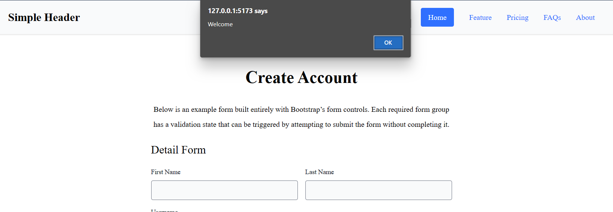
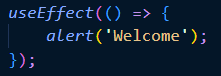

# Materi React Hook

## Resume Materi KMReact - React Hook

Poin penting yang dapat dipelajarin dari materi React Hook adalah

#### 1. Pengertian Hooks

Hooks merupakan fitur baru di React 16.8. Dengan Hooks, kita dapat menggunakan state dan fitur React yang lain tanpa perlu menulis sebuah class. Motivasi atau alasan menggunakan hooks adalah sebagai berikut:

- Kesulitas menggunakan kembali stateful logic antar komponen
- komponen kompleks menjadi sulit untuk dimengerti
- class membingungkan manusia dan mesin

Hooks dasar:

- useState
- useEffect
- useContext

Hooks tambahan:

- useReducer
- useCallBack
- useMemo
- useRef
- useImperativeHandle
- useLayoutEffect
- useDebugValue

Dalam hooks terdapat beberapa aturan seperti

- Panggil hooks hanya di tingkat atas. Jangan memanggil hooks pada loops, conditions atau nested function.
- Panggil hooks hanya dari fungsi-fungsi react. Kita dapat memanggil hooks dari komponen fungsi react atau memanggil hooks dari custom hooks.

#### 2. useState dan useEffect

useState merupakan sebuah hook yang dipanggil dalam function component untuk menambahkan suatu state lokal. useState akan memberikan dua hal yaitu nilai state saat ini dan fungsi untuk memperbarui nilai tersebut.

```
// Contoh useState
import React, { useState } from 'react';

function Example() {
  // Deklarasi sebuah variabel state baru, dimana akan dinamakan "count"
  const [count, setCount] = useState(0);

  return (
    <div>
      <p>Anda klik sebanyak {count} kali</p>
      <button onClick={() => setCount(count + 1)}>
        Klik saya
      </button>
    </div>
  );
}
```

useEffect merupakan sebuah hook yang memungkinkan kita melakukan efek samping (side effect) di dalam function component. Hook ini memiliki fungsi yang sama dengan componentDidMount, componentDidUpdate, dan componentWillUnmount

```
// Contoh useEffect
import React, { useState, useEffect } from 'react';

function Example() {
  const [count, setCount] = useState(0);

  // Sama seperti componentDidMount dan componentDidUpdate:
  useEffect(() => {
    // Memperbarui judul dokumen menggunakan API browser
    document.title = `Anda klik sebanyak ${count} kali`;
  });

  return (
    <div>
      <p>Anda klik sebanyak {count} kali</p>
      <button onClick={() => setCount(count + 1)}>
        Klik saya
      </button>
    </div>
  );
}
```

#### 3. Custom Hooks

Custom Hooks berarti membuat hook kita sendiri dan memungkinkan kita mengekstrak komponen logika ke fungsi yang dapat digunakan lagi.

---

## Task

#### Soal Prioritas 1

1. Dengan menggunakan useEffect buatlah sebuah alert yang bertulisan “Welcome” ketika mereka membuka halaman CreateAccount.
   
   
2. Dengan menggunakan UseState masukkan setiap data yang kalian isi pada halaman CreateProduct ke dalam tabel. data yang akan tampil hanya no,Product Name, Product Category, Product Feshness dan Product Price. data yang lain tidak di tampilkan pada user interface.
   

3. Nomor dibuat random menggunakan UUID atau sejenisnya. pastikan tidak ada duplikasi nomor.

#### Soal Prioritas 2

1. Buatlah tombol delete berfungsi, pastikan ketika ingin melakukan delete terdapat alert/modal/notifikasi yang bertuliskan apakah kalian ingin menghapus.
   - Jika pilih hapus maka data baru akan terhapus.
   - Jika pilih tidak maka alert/modal/notifikasi akan hilang.
     

#### Soal Eksplorasi

1. Buatlah fitur edit berfugsi, kalian bebas menggunakan hook, library atau hal lain sesuai keinginan kalian.
2. Flow untuk melakukan edit tidak di tentukan, yang terpenting adalah kalian dapat melakukan edit data

Ketika klik button edit, maka data pada tabel akan ditampilkan di form untuk bisa diedit.<br>

