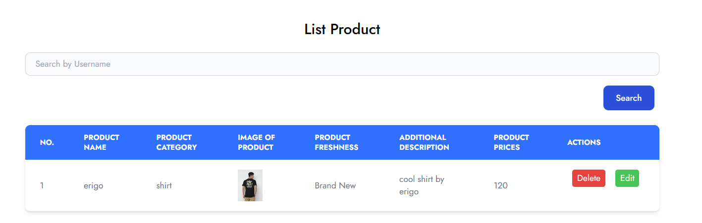

# Materi React Hook

## Resume Materi KMReact - React Hook

Poin penting yang dapat dipelajarin dari materi React Hook adalah

#### 1. Penjelasan React Hooks

Hooks merupakan fitur baru di React 16.8. Dengan Hooks, kita dapat menggunakan state dan fitur React yang lain tanpa perlu menulis sebuah kelas.

Motivasi untuk menggunakan hooks adalah

- adanya kesulitan untuk menggunakan kembali stateful logic antar komponen.
- adanya komponen kompleks menjadi sulit untuk dimengerti.
- adanya class membingungkan manusia dan mesin.

Hooks dasar:

- useState
- useEffect
- useContext

Hooks tambahan:

- useReducer
- useCallback
- useMemo
- useRef
- useImperativeHandle
- useLayoutEffect
- useDebugValue

Aturan yang ada pada hook:

- jangan memanggil hook dari loop, condition atau nested function
- jangan memanggil hook dari fungsi javascript biasa. kita bisa memanggil hook dari komponen fungsi react dan custom hook.

#### 2. useState dan useEffect

useState di panggil dalam function component untuk menambahkan suatu state lokal. React akan menyimpan state antar render. useState memberikan dua hal: nilai state saat ini dan fungsi untuk memperbarui nilai tersebut.

```
// Contoh useState
import React, { useState } from 'react';

function Example() {
  // Deklarasi sebuah variabel state baru, dimana akan dinamakan "count"
  const [count, setCount] = useState(0);

  return (
    <div>
      <p>Anda klik sebanyak {count} kali</p>
      <button onClick={() => setCount(count + 1)}>
        Klik saya
      </button>
    </div>
  );
}
```

useEffect memungkinkan kita melakukan efek samping (side effects) di dalam function component. useEffect sama seperti componentDidMount, componentDidUpdate dan componentWillUnmount. Ada dua jenis useEffect yaitu butuh pembersihan dan tidak butuh pembersihan.

```
// Contoh useEffect
import React, { useState, useEffect } from 'react';

function Example() {
  const [count, setCount] = useState(0);

  // Sama seperti componentDidMount dan componentDidUpdate:
  useEffect(() => {
    // Memperbarui judul dokumen menggunakan API browser
    document.title = `Anda klik sebanyak ${count} kali`;
  });

  return (
    <div>
      <p>Anda klik sebanyak {count} kali</p>
      <button onClick={() => setCount(count + 1)}>
        Klik saya
      </button>
    </div>
  );
}
```

#### 3. Custom Hook

Custom Hook merupakan bagaimana membuat hook kita sendiri memungkinkan kita mengekstrak komponen logika ke fungsi yang dapat digunakan lagi.

---

## Task

#### Soal Prioritas 1

1. Dengan menggunakan useEffect buatlah sebuah alert yang bertulisan “Welcome” ketika mereka membuka halaman CreateAccount.
   
2. Dengan menggunakan UseState masukkan setiap data yang kalian isi pada halaman CreateProduct ke dalam tabel. data yang akan tampil hanya no,Product Name, Product Category, Product Feshness dan Product Price. data yang lain tidak di tampilkan pada user interface.
   
3. Nomor dibuat random menggunakan UUID atau sejenisnya. pastikan tidak ada duplikasi nomor.
   

#### Soal Prioritas 2

1. Buatlah tombol delete berfungsi, pastikan ketika ingin melakukan delete terdapat alert/modal/notifikasi yang bertuliskan apakah kalian ingin menghapus.

- Jika pilih hapus maka data baru akan terhapus.
- Jika pilih tidak maka alert/modal/notifikasi akan hilang.

Jika meng-klik button delete, maka akan muncul pop-up untuk melakukan konfirmasi hapus pada data yang ada di tabel.<br>


#### Soal Eksplorasi

1. Buatlah fitur edit berfugsi, kalian bebas menggunakan hook, library atau hal lain sesuai keinginan kalian.
2. Flow untuk melakukan edit tidak di tentukan, yang terpenting adalah kalian dapat melakukan edit data.

Ketika meng-klik button edit, maka data yang telah ditampilkan pada tabel akan muncul di form agar bisa diubah/diedit.<br>

