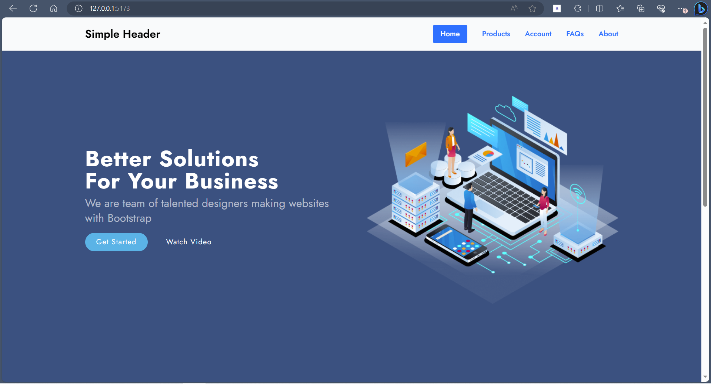
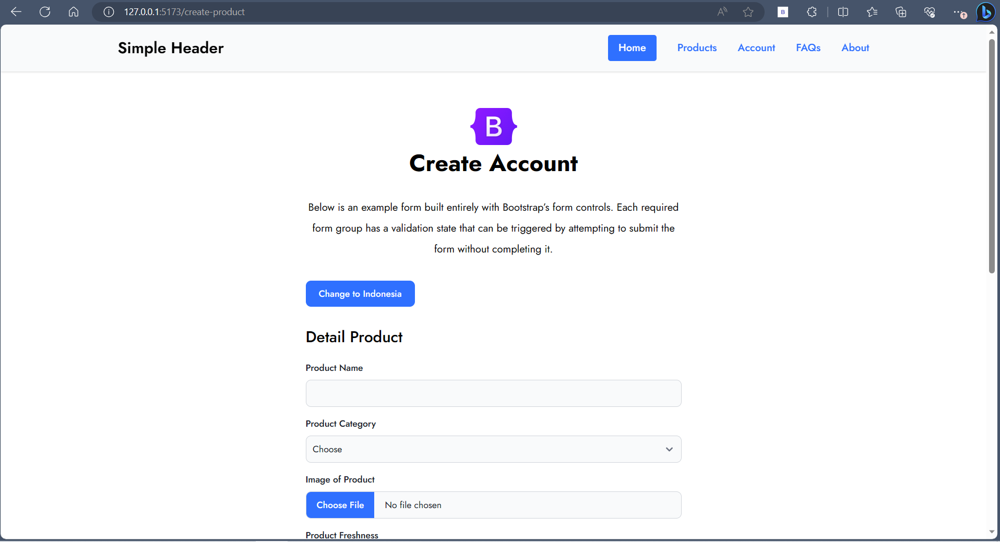
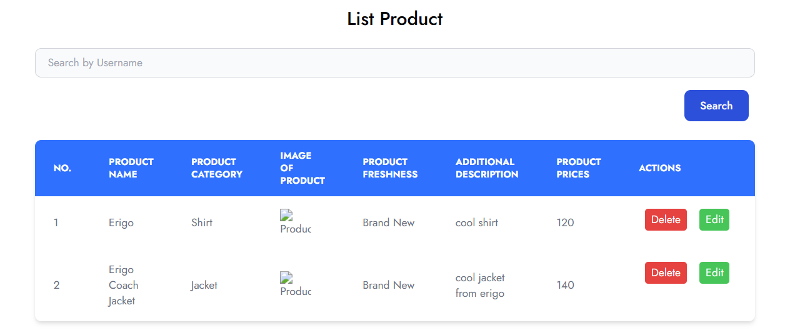
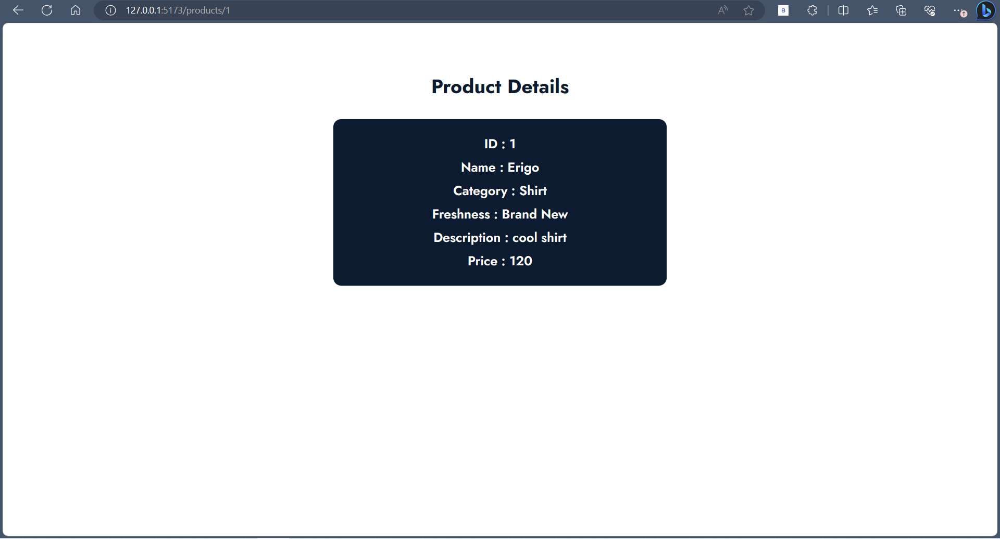
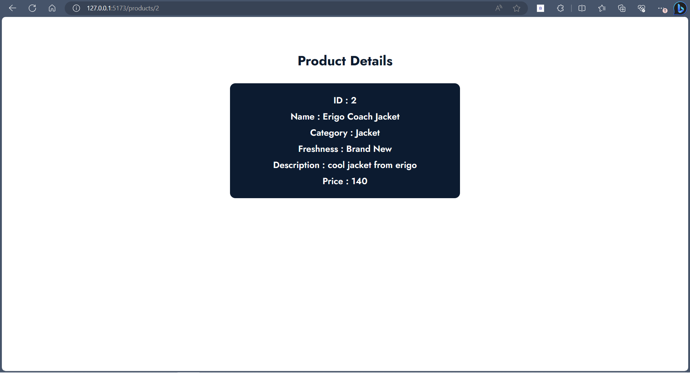

# Materi React Routing

## Resume Materi KMReact - React Routing

Poin penting yang dapat dipelajarin dari materi React Routing adalah

#### 1. Pengertian Router

Router merupakan sebuah modul dalam react yang berfungsi untuk melakukan proses navigasi pada SPA (Single Page Application).

#### 2. Multi Page Application dan Single Page Application

1. Multi Page Application
   Multi Page Application (MPA) atau disebut dengan tradisional web app adalah jenis aplikasi website yang dimana perlu memuat ulang seluruh halaman web setiap kali membuat permintaan baru.

   **Keunggulan MPA**:

   - SEO website akan lebih mudah dioptimasi.
   - Memudahkan untuk mengubah halaman tertentu untuk setiap kebutuhan yang berbeda.
   - Menggunakan tools analisis seperti Google Analytics yang dapat terintegrasi langsung dengan website.

   **Kekurangan MPA**:

   - Kecepatan download website menjadi lebih lama dibandingkan SPA.
   - Perlu mengintegrasikan antara front-end dan back-end.
   - Lebih sering membutuhkan maintenance dan update.
   - Mungkin akan lebih sering masalah performa pada website.

2. Single Page Application
   Single Page Application (SPA) adalah salah satu jenis aplikasi website dimana hanya ada 1 halaman yang menangani semua aktivitas yang terjadi dalam aplikasi tersebut.

   **Keunggulan SPA**:

   - Waktu loading lebih cepat.
   - Tidak ada query tambahan ke server.
   - Front-End yang cepat dan responsif.
   - Meningkatkan UX

   **Kekurangan SPA**:

   - Kurang bagus dalam hal SEO.
   - Berat saat di-load/buka pertama kali.
   - Kurang aman dibanding website biasa.
   - Masalah kompabilitas browser.

#### 3. Hook Routing

Terdapat empat hook routing pada react:

1. useHistory
   useHistory memberi akses ke instance riwayat yang dapat digunakan untuk bernavigasi.
2. useLocation
   useLocation mengembalikan objek lokasi yang mewakili URL saat ini.
3. useParams
   useParams mengembalikan objek pasangan kunci/nilai parameter URL. Gunakan untuk mengakses match.params dari <Route> saat ini.
4. useRouteMatch
   useRouterMatch digunakan untuk mencocokan URL saat ini dengan cara yang sama seperti <Route>. Hal ini berguna untuk mendapatkan akses ke data kecocokan tanpa benar - benar merender <Route>.

---

## Task

#### Soal Prioritas 1

1. Buatlah halaman LandingPage berdasarkan LandingPage.html yang telah kalian buat pada tugas sebelumnya.
   
2. Tambahkan tombol pada komponen LandingPage.jsx untuk menavigasi ke komponen CreateProduct.jsx dan Gunakan React Routing untuk navigasi antara component LandingPage.jsx dan CreateProduct.jsx.
   Apabila melakukan klik pada button product pada navigasi yang ada maka akan langsung mengarahkan langsung ke halaman create-product 
   

#### Soal Prioritas 2

1. Dengan memanfaatkan react routing buatlah fitur ketika user melakukan klik salah satu data pada tabel maka akan masuk ke halaman lain dan memunculkan data tersebut secara lengkap.
2. Contoh : ketika user melakukan klik pada nomor “1,001” maka halaman akan berganti ke routing baru “localhost/account/1,001”. pada halaman ini akan berisikan data lengkap dari user tersebut. User Interface tidak ditentukan.
   Tabel menampilkan data yang telah disubmit pada form create product. 
   
   Ketika klik pada nomor yang ada pada tabel maka akan mengarahkan ke routing baru yaitu "localhost/products/id". Pada gambar di bawah ini id atau nomor yang diklik pada nomor 1, sehingga routing ke "localhost/products/1" dan menampilkan data data yang ada pada tabel sesuai nomor yang diklik. 
    
   

#### Soal Eksplorasi

1. Buatlah sebuah fitur private routing, sehingga hanya user yang sudah login yang bisa mengakses halaman-halaman tertentu.
2. Kalian dapat menggunakan localstorage atau variabel biasa sebagai parameter user tersebut sudah login atau belum.
