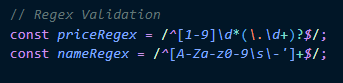
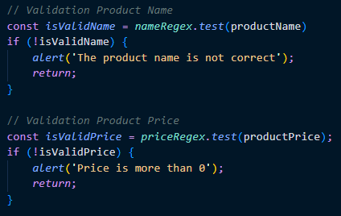
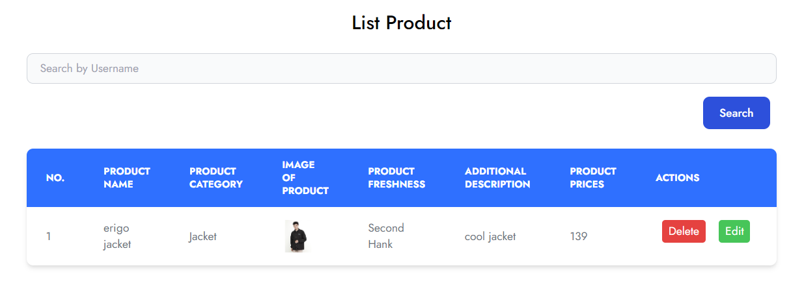
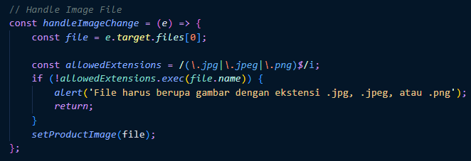

# Materi React Form

## Resume Materi KMReact - React Form

Poin penting yang dapat dipelajarin dari materi React Form adalah

#### 1. Penjelasan Form

Form merupakan salah satu hal krusial dalam pengembangan aplikasi website. Form ini digunakan untuk menghandle inputan dari user.

#### 2. Controlled Component & Uncontrolled Component

Controlled Component adalah sebuah element masukan form yang nilainya dikontrol oleh react melalui cara menyimpan dan memperbarui state di HTML dan React dengan menggunakan state.

Uncontrolled Component adalah alternatif lain dari controlled component, yang dimana data form akan ditangani oleh DOM-nya sendiri. Untuk menulis uncontrolled component, alih alih menulis event handler untuk setiap pembaruan state, kita dapat menggunakan ref untuk mendapatkan nilai form dari DOM.

#### 3. Alasan memerlukan validasi form

Pada dasarnya, ada 3 alasan mengapa validasi diperlukan:

- mencari input data yang benar dan sesuai format.
- Melindungi akun pengguna. Misalnya membuat pengguna untuk memasukkan data password yang aman.
- Melindungi sistem/aplikasi. Validasi form yang kuat dapat meminimalisir perilaku pengguna yang ingin meretas sistem/aplikasi.

---

## Task

#### Soal Prioritas 1

1. Regex validasi pada product name, product category, product freshness, product price yang telah kalian buat pada halaman CreateProduct.
    
   

#### Soal Prioritas 2

1. Buatlah form image dan Product Freshness dapat berfungsi dan ketika user menggunakan form tersebut. datanya akan masuk ke dalam tabel.
   
2. Buatlah validasi untuk Image dan Product Freshness sehingga data yang di masukkan valid.
   

#### Soal Eksplorasi

1. Buat form registrasi pengguna yang meminta data first name, last name, username, email, password, dan confirm password. Gunakan library form tertentu (seperti Formik, Redux Form, dll.) dan pastikan validasi form yang diterapkan meliputi:

- First name dan last name harus memiliki panjang minimal 3 karakter.
- Email harus memiliki format email yang valid.
- Password harus memiliki panjang minimal 8 karakter dan harus cocok dengan confirm password.

2. Buat form login yang meminta data email dan password. Gunakan state dan event handlers untuk mengontrol input dan memvalidasi form, dengan validasi sebagai berikut:

- Email harus memiliki format email yang valid.
- Password harus memiliki panjang minimal 8 karakter.
- Tampilkan pesan error jika salah satu dari kedua field tidak valid.

3. Buatlah form register dan login menjadi sebuah halaman. Kemudian, buat sebuah routing sehingga user dapat berpindah-pindah halaman. Kalian bebas bereksperimen terkait flow, tata leta, dan user interface pada kedua halaman ini.

Catatan: Pastikan setiap form memiliki tata letak yang rapi dan mudah dibaca. Gunakan styling CSS untuk mempercantik tampilan form. kalian bebas menggunakan framework CSS apapun untuk memudahkan membuat tampilan.
