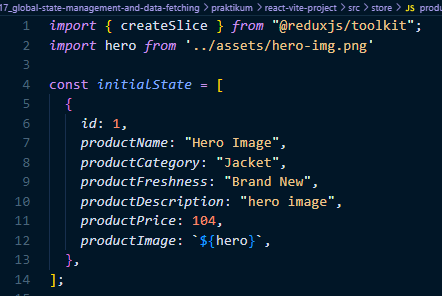
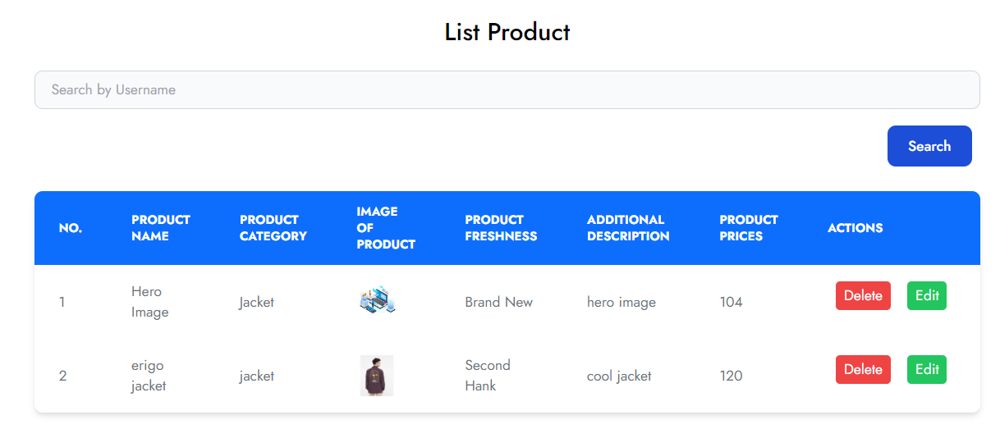
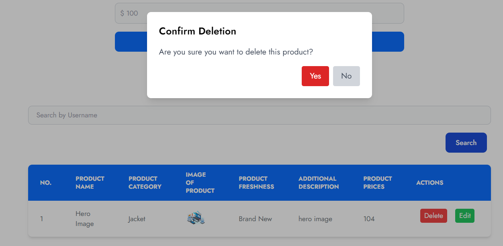
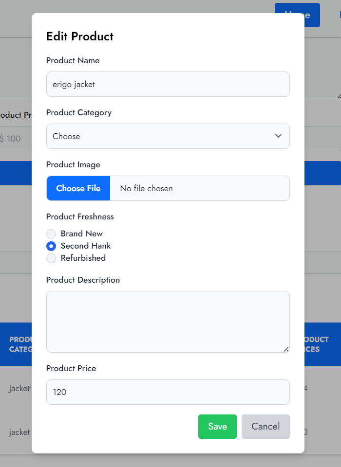

# Materi Global State Management and Data Fetching

## Resume Materi KMReact - Global State Management and Data Fetching

Poin penting yang dapat dipelajarin dari materi Global State Management and Data Fetching adalah

#### 1. Penggunaan Redux

Redux adalah salah satu library state management yang biasa disandingkan dengan react yang digunakan untuk menyimpan state di satu tempat, sehingga lebih mudah untuk di manage.
Kapan saat yang tepat untuk menggunakan redux:

- Banyak state yang perlu ditaruh di banyak tempat
- State pada app sering berubah
- Logic untuk mengubah state kompleks
- Ukuran codebase yang sedang-besar, dan dikerjakan oleh banyak orang
- Perlu untuk mengetahui bagaimana state diupdate seiring dengan waktu

Redux library dan Tools yang digunakan:

- React-Redux
- Redux Toolkit
- Redux DevTools Extension

#### 2. Komponen Penting Redux

Komponen penting pada redux:

- Actions, digunakan untuk memberikan informasi dari aplikasi ke store
- Reducer, digunakan untuk mengambil state saat ini dan object action lalu mengembalikan state aplikasi baru
- Store, objek sentral yang menyimpan state pada aplikasi

Memakai dan mengubah state pada redux dapat menggunakan hooks dan connect

#### 3. Data Fetching

Cara untuk fetching data di react:

- Fetch API
- Axios
- React Query Library

---

## Task

#### Soal Prioritas 1

1. Ubahlah list products yang sebelumnya berupa state biasa menjadi global state menggunakan redux.
   
2. Masukkan data user ke dalam Initial state. Pastikan data List Product berasal dari initialState pada store.
   

#### Soal Prioritas 2

1. Tambahkan fitur untuk menambah, mengedit, dan menghapus data user dalam komponen ListProduct.jsx dengan menggunakan action dan reducer yang sesuai. untuk form edit/menambah kalian dapat menggunakan komponent CreateProduct.jsx atau membuat komponen lain jika diperlukan.
    
    
   

#### Soal Eksplorasi
