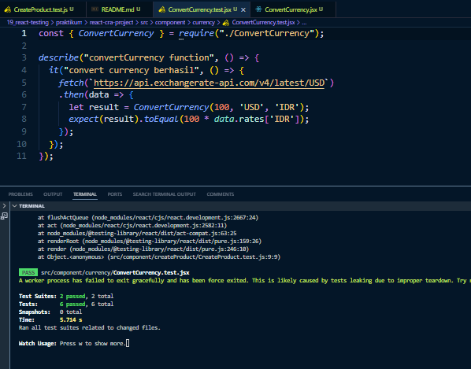

# Materi React Testing

## Resume Materi KMReact - React Testing

Poin penting yang dapat dipelajarin dari materi React Testing adalah

#### 1. Pengertian Testing

Testing adalah proses memverifikasi bahwa test assertions kita benar dan bahwa code kita tetap benar sepanjang masa aplikasi. Test assertion ini adalah ekspresi boolean yang mengembalikan nilai true kecuali ada bug di kode kita.

#### 2. Manfaat Testing

- Ketika aplikasi mempunyai coverage yang baik (mayoritas codebase tercover oleh test). Kita akan merasa percaya diri jika harus mengubah bagian tersebut. dan ada bagian yang lain menjadi broken kita akan segera mengetahuinya.
- Mengurangi bug pada aplikasi. Walaupun testing tidak menjamin aplikasi kita bebas bug, tetapi kita bisa mencegah beberapa hal yang berpotensi menjadi bug.

#### 3. Tools Testing

- Jest
- React Testing Library

---

## Task

#### Soal Prioritas 1

1. Buatlah file baru bernama CreateProduct.test.js didirectory yang sama tempat CreateProduct.jsx disimpan.
2. Pada file CreateProduct.test.js buatlah test untuk memastikan bahwa form input Product Name dapat menerima input teks dan menampilkannya di halaman.
   
3. Buatlah test untuk memastikan bahwa pilihan setiap form yang dipilih dapat disimpan dan ditampilkan dengan benar.
   

#### Soal Prioritas 2

1. Buatlah test untuk memastikan validasi form input yang benar, seperti memastikan bahwa Product Name tidak boleh kosong, tidak mengandung karakter @/#{}.
   
2. Buatlah test untuk memastikan validasi form input yang benar bahwa Product Name tidak melebihin 25 karakter.
   
3. Buatlah test untuk memastikan validasi semua form field tersebut tidak boleh kosong.
   

#### Soal Eksplorasi

1. Buatlah test untuk memastikan bahwa form dapat menampilkan pesan error jika terjadi kesalahan saat menyimpan data ke state.
   
2. Buatlah sebuah function seperti kode berikut. Sebuah function dengan JavaScript yang dapat digunakan untuk mengubah nilai sebuah mata uang.
   
3. Lakukan testing pada function convertCurrency diatas.
   
