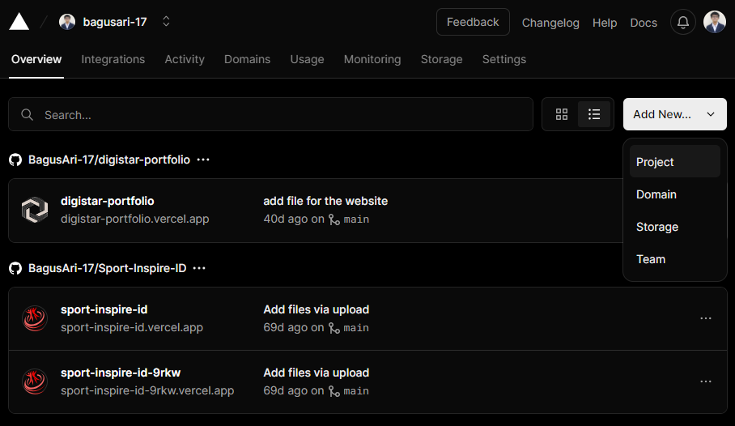
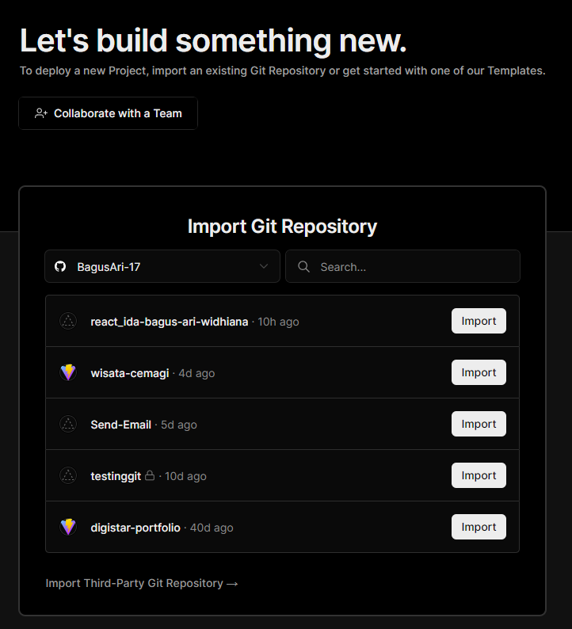
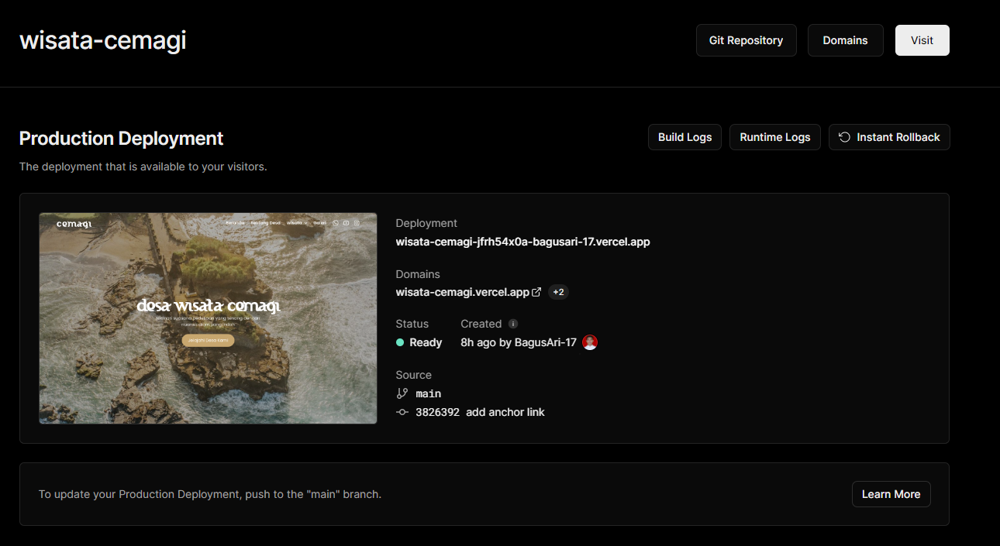
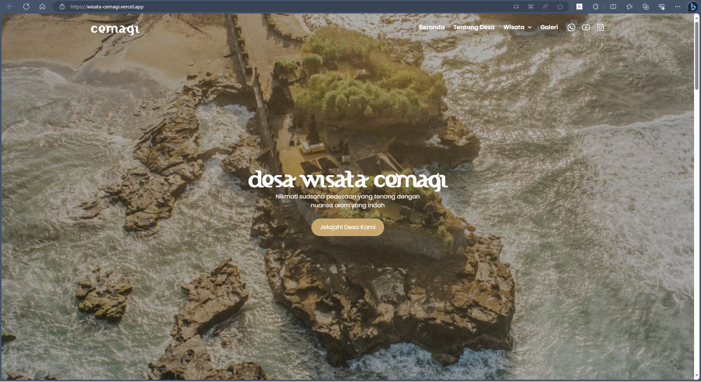

# Materi Deployment

## Resume Materi KMReact - Deployment

Poin penting yang dapat dipelajarin dari materi Deployment adalah

#### 1. Pengertian Deployment

Deployment adalah kegiatan yang bertujuan untuk menyebarkan aplikasi yang sudah kita buat. Harapannya aplikasi tersebut dapat diakses oleh banyak orang, tidak hanya oleh kita sendiri.

#### 2. React Build App

Tujuan melakukan build pada react adalah agar aplikasi yang kita buat menjadi versi production sehingga performa menjadi lebih ringan dan cepat. Jika tidak melakukan build maka react akan mengandung banyak pesan peringatan yang membuat react menjadi lebih berat dan lambat.

```
// Lakukan Build pada CRA
npm run build
```

#### 3. Deploy Website

Berikut layanan untuk deployment website secara gratis yang dapat digunakan:

- Vercel
- Surge

---

## Task

#### Soal

1. Buat akun di Vercel dan buat project baru.
   
2. Integrasikan akun Vercel dengan akun GitHub Anda.
3. Buat repository baru di GitHub untuk menyimpan project ReactJs kamu jika belum, dan push kode aplikasi ReactJS Anda ke repository tersebut jika belum.
4. Pilih repository yang telah kalian push kode aplikasi ke dalamnya di Vercel, kemudian ikuti langkah-langkah untuk mendeploy aplikasi ReactJS ke Vercel.
   - Disini saya memilih repository "wisata-cemagi"
     
5. Pastikan aplikasi kalian dapat di akses dengan URL yang telah diberikan Vercel
   - Setelah mengikuti langkah-langkah yang ada maka deployment berhasil dilakukan
     
   - Deployment dapat diakses melalui link URL berikut: [Link URL Deployment](https://wisata-cemagi.vercel.app/)
     
