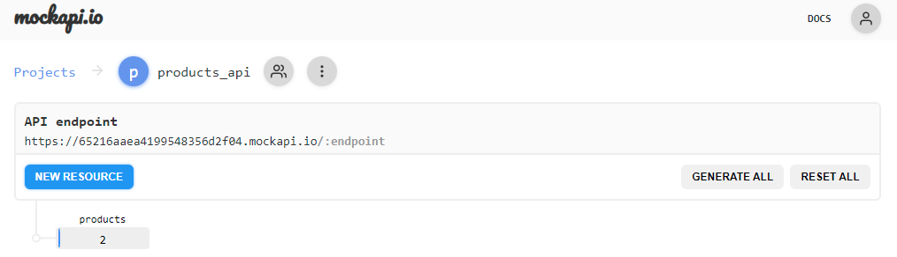
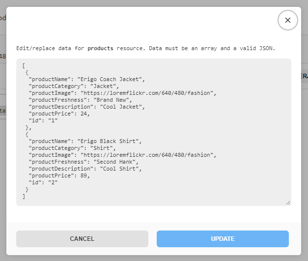
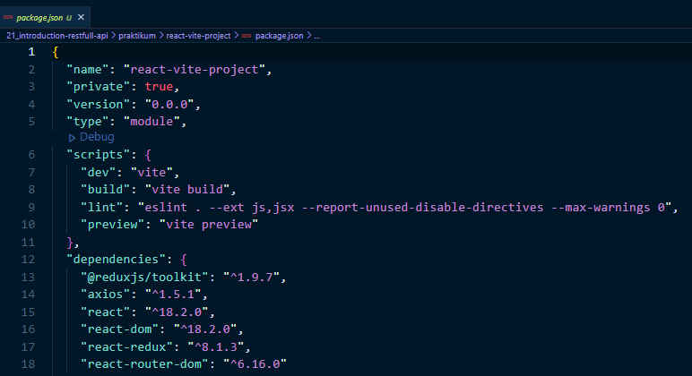
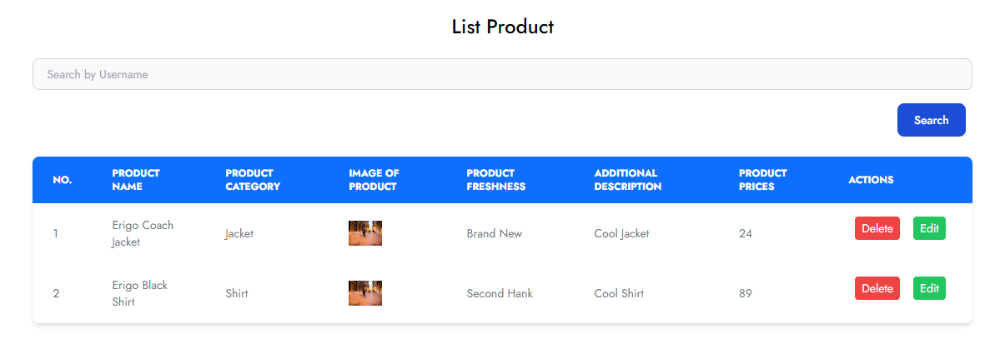

# Materi Introduction Restfull API

## Resume Materi KMReact - Introduction Restfull API

Poin penting yang dapat dipelajarin dari materi Introduction Restfull API adalah

#### 1. API

API (Application Programming Interface) merupakan Seperangkat fungsi dan prosedur yang memungkinkan pembuatan aplikasi mengakses fitur atau data dari sistem operasi, aplikasi, atau layanan lainnya. API bekerja dengan cara menghubungkan sisi client dan sisi server. Client akan mengirimkan request pada server dan nanti server akan mengirimkan response. Request dan Response tersebut dapat memiliki format JSON, XML atau SOAP.

#### 2. HTTP Protocol

HTTP (Hypertext Transfer Protocol) adalah protokol komunikasi yang digunakan untuk mentransfer data melalui internet. Ini digunakan ketika browser web mengirimkan permintaan untuk halaman web kepada server web dan menerima respons dari server tersebut.

HTTP mendefinisikan serangkaian metode request untuk menunjukkan tindakan yang diinginkan untuk dilakukan pada sumber daya tertentu. Hal ini biasa disebut sebagai HTTP Method. Terdapat beberapa HTTP Request Method:

- GET
- POST
- PUT
- DELETE
- HEAD
- OPTION
- PATCH

Selain itu, terdapat juga HTTP Response Status Code, yaitu:

- Informational responses (100 – 199)
- Successful responses (200 – 299)
- Redirection messages (300 – 399)
- Client error responses (400 – 499)
- Server error responses (500 – 599)

#### 3. JSON

JSON (JavaScript Object Notation) adalah format pertukaran data ringan yang digunakan untuk menyimpan dan mengirim data. Format JSON bersifat teks dan merupakan cara umum untuk mentransfer data antar server web dan klien web, serta digunakan dalam penyimpanan dan pertukaran data di berbagai aplikasi.

---

## Task

#### Soal

1. Buat akun di MockAPI (https://mockapi.io/)
   
2. Buat endpoint baru di MockAPI dengan spesifikasi minimal sebagai berikut:

   - Method: GET
   - URL: /products
   - Response: JSON array yang berisi daftar product
   - Skema product memiliki field yang sama seperti form input CreateProduct.jsx

   

3. Tambahkan dependensi axios ke aplikasi ReactJS kalian
   
4. Sambungkan data pada mockAPI ke List Product. Gunakan axios untuk mengambil data dari endpoint MockAPI dan tampilkan daftar user tersebut di komponen/halaman ListProduct.jsx yang sudah anda buat untuk menampilkan List Account.
   
