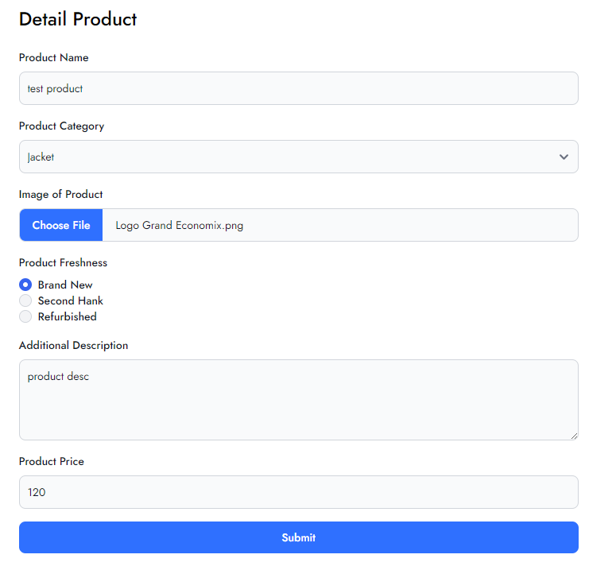
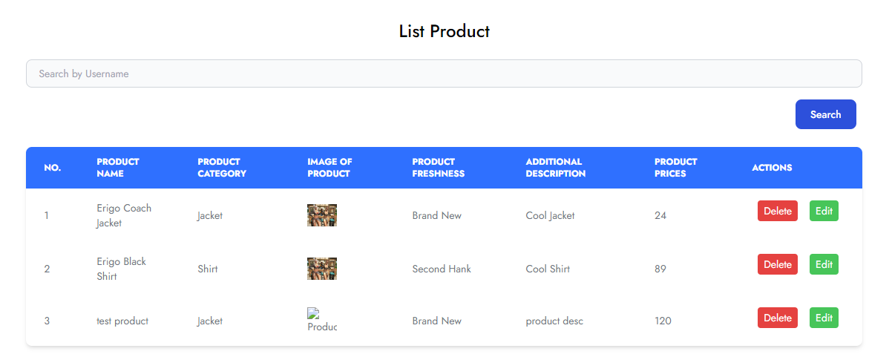
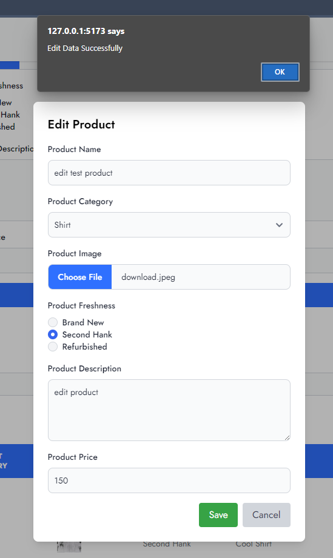
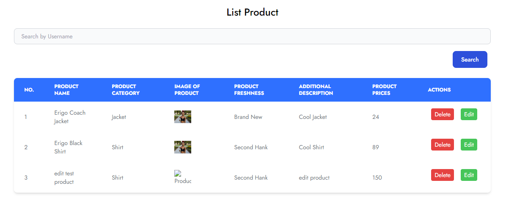
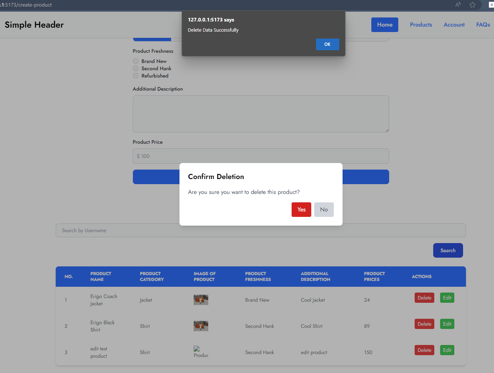
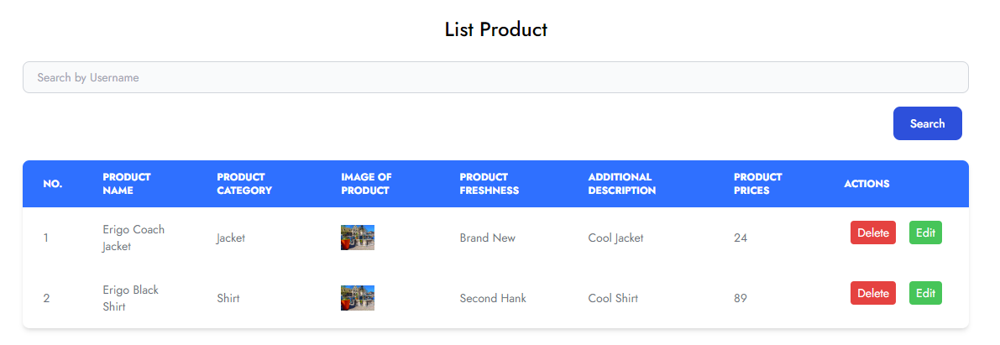

# Materi Restfull API with Javascript

## Resume Materi KMReact - Restfull API with Javascript

Poin penting yang dapat dipelajarin dari materi Restfull API with Javascript adalah

#### 1. MOCK API

Untuk mendapatkan API, kita bisa menggunakan API Public untuk data dummy atau contoh endpoint yang biasa bisa kita sebut Fake API. Oleh karena itu kita dapat menggunakan MOCK API untuk membuat Fake API.

#### 2. Manfaat MOCK API

Berikut beberapa manfaat menggunakan MOCK API:

- Frontend dan Backend dapat bekerja bersama.
- Fast feedback loop.
- Menemukan permasalahan lebih awal dan cepat.
- Developing test dan API bersama.

#### 3. Mock APIs Available

- Beeceptor
- Mockoon
- Mocki
- Stoplight
- Postman Mock Server
- Mocky
- MockAPI

---

## Task

#### Soal

1. Pada data dari form input komponen CreateProduct.jsx yang sebelumnya disimpan kedalam state dan LocalStorage. Sekarang simpan data tersebuh ke Rest API yang sudah kalian buat dengan MockAPI menggunakan librrary axios dan dengan http method POST dan tampilkan pesan sukses jika berhasil menyimpan data.
   
   
2. Buatlah fitur update data user dihalaman ListProduct.jsx dan update data product dari RestAPI yang sudah kalian buat dengan MockAPI. Update data product dengan mengirim request ke Rest API tersebut menggunakan library axios dengan http method PUT dan tampilkan pesan sukses diupdate jika berhasil mengupdate data.
   
   
3. Buatlah fitur delete data product dihalaman ListProduct.jsx. Lakukan request ke server Rest API dengan axios ke endpoint untuk delete data dengan http method DELETE dan berikan pesan sukses delete jika berhasil menghapus data dari server Rest API.
   
   
