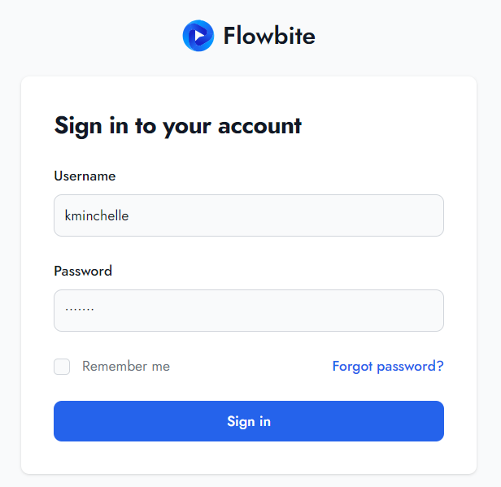

# Materi Authentication in React

## Resume Materi KMReact - Authentication in React

Poin penting yang dapat dipelajarin dari materi Authentication in React adalah

#### 1. Authorization

Sebuah fungsi spesifik untuk memberikan akses kepada right previleges atau orang yang benar unutk mengakses resource yang ada, berhubungan dengan informasi umum, keamanan dan keamanan komputer serta untuk mengakses kontrol. Atau bisa dikatakan memberikan akses kepada orang yang tepat pada halaman website kita untuk mengakses fitur atau resource yang telah ditentukan.

#### 2. Login

Login digunakan untuk bagian pengamanan sistem dalam sebuah halaman website. Login merupakan sebuah proses dimana individu atau user mendapatkan akses ke bagian komputer sistem dengan cara mengidentifikasi dan mengenali siapa user ini dengan cara memasukkan username dan password yang telah dibuat oleh user sebelumnya.

#### 3. Simple Login

1. Open App
2. If Auth Token Available then attempt login. After that, if Successfull then show UserViewController.
3. If Auth Token didn't available, show login screen. After that enter credentials to attempt login.

---

## Task

#### Soal

1. Buatlah Authentication dan Authorization dari project yang telah kalian buat sebelumnya. manfaatkan data dummy pada local storage untuk proses tersebut.
   Untuk Auth saya menggunakan dummy API dari dummyjson.com 
   Ketika user melakukan login dengan memasukkan username dan password 
    
   Jika username dan password benar maka akan langsung mengarahkan ke Landing Page. Ketika melakukan Log Out maka akan langsung diarahkan ke Login Page 
   
