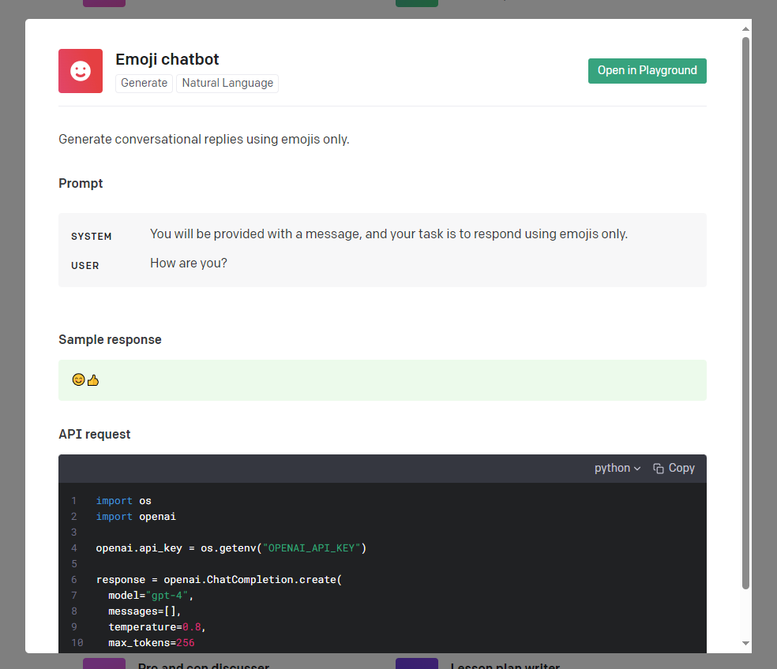
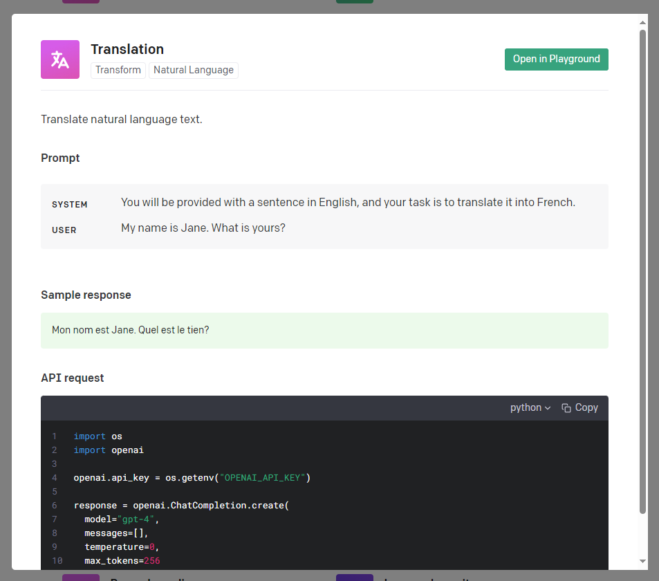
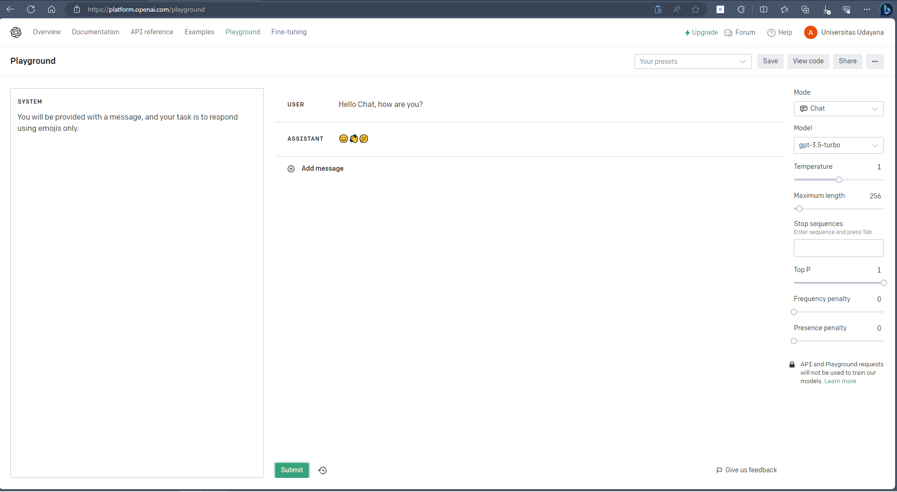
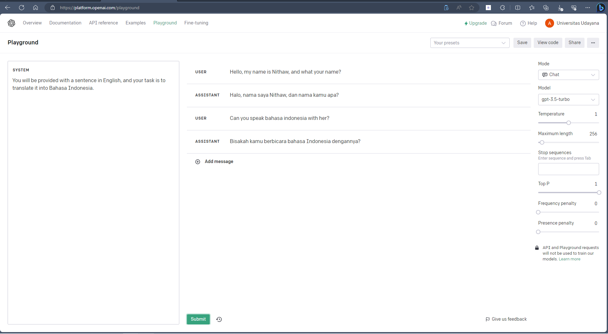

# Materi Perkenalan AI dan Open AI React

## Resume Materi KMReact - Perkenalan AI dan Open AI React

Poin penting yang dapat dipelajarin dari materi Perkenalan AI dan Open AI React adalah

#### 1. Pengertian AI

AI merupakan sebuah mesin yang bisa melakukan tugas dan berpikir layaknya manusia. Bisa juga dikatakan sebagai sebuah bidang ilmu komputer yang terfokus pada pembuatan mesin yang memiliki akal, bisa belajar dan mengambil tindakan secara mandiri.

#### 2. Teknologi Penggerak AI

- Data
- Algoritma
- Perangkat keras
- Komputasi awan
- Investasi atau pendanaan

#### 3. Pengaplikasian AI di dunia nyata

AI sangat dimanfaatkan dalam kehidupan manusia seperti:

- Sales Forecasting
- Content Personalization
- Dynamic Pricing
- Personalized Medicine
- Medical Image Analysis
- Patient Monitoring
- Face Recognition
- Speech Recognition
- Autonomous Vehicle
- Sentiment Analysis

dan masih banyak lagi

---

## Task

#### Soal

1. Praktikkan penggunakan [OpenAI Playground](https://platform.openai.com/playground)
2. Bisa menggunakan salah satu template yang ada di [platform.openai.com/examples](https://platform.openai.com/examples)
   Template yang saya gunakan pada OpenAI Playground adalah **Emoji Chatbot** dan **Translation**. 
    
   Emoji Chatbot akan melakukan generate pesan hanya menggunakan emoji. 
    
   Translation akan melakukan generate pesan yang menerjemahkan prompt kita ke sebuah bahasa tertentu.
3. Screenshot hasilnya (pastikan semua yang ada di layar masuk ke dalam screenshot)
    
   Ini hasil dari penggunaan template Emoji Chatbot. Kita dapat memasukkan template system di bagian sebelah kiri. Dan untuk prompt user dapat diisi pada bagian tengah. Jika di submit promptnya maka AI akan langsung membalas prompt kita hanya menggunakan emoji. 
    
    
   Ini hasil dari penggunaan template Translation. Kita dapat memasukkan template system di bagian sebelah kiri. Dan untuk prompt user dapat diisi pada bagian tengah. Jika di submit promptnya maka AI akan langsung membalas prompt kita dengan menerjemahkan prompt ke sebuah bahasa tergantung template system yang diisi.
4. Copy-paste input & output (text yang ada di dalam textbox) ke file txt
   **Emoji Chatbot** 
   System : You will be provided with a message, and your task is to respond using emojis only. 
   User : Hello Chat, how are you? 
   Assistant : 😊👋🤔 
    
   **Translation** 
   System : You will be provided with a sentence in English, and your task is to translate it into Bahasa Indonesia. 
   User : Hello, my name is Nithaw, and what your name? 
   Assistant : Halo, nama saya Nithaw, dan nama kamu apa? 
   User : Can you speak bahasa indonesia with her? 
   Assistant : Bisakah kamu berbicara bahasa Indonesia dengannya? 
5. Kumpulkan hasil screenshot dan file txt seperti biasa
   [Link Gdocs](https://docs.google.com/document/d/1FUhWPp3C7NVIKN9RuhizSZXWPlrXJgWmkc8DE-U54Ik/edit?usp=sharing)
