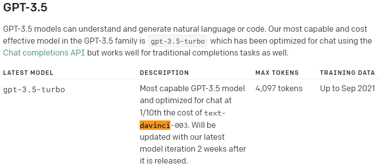
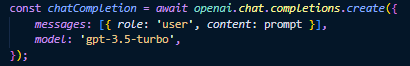
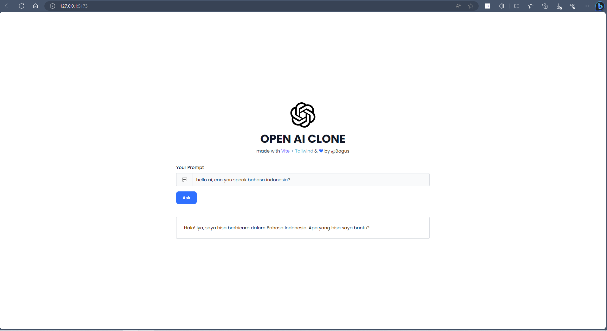
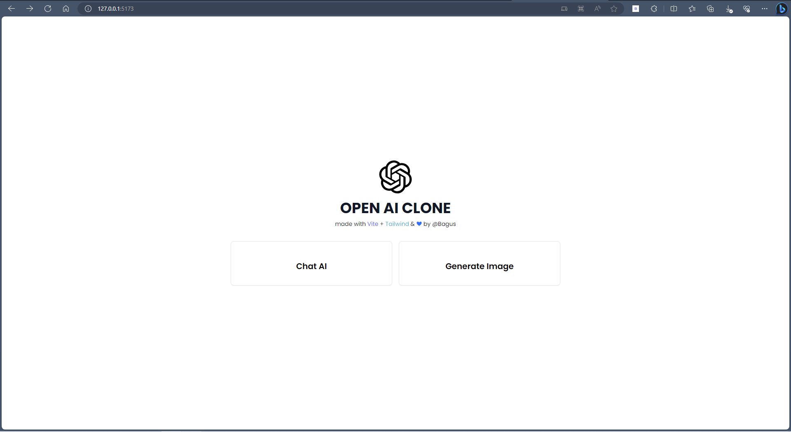
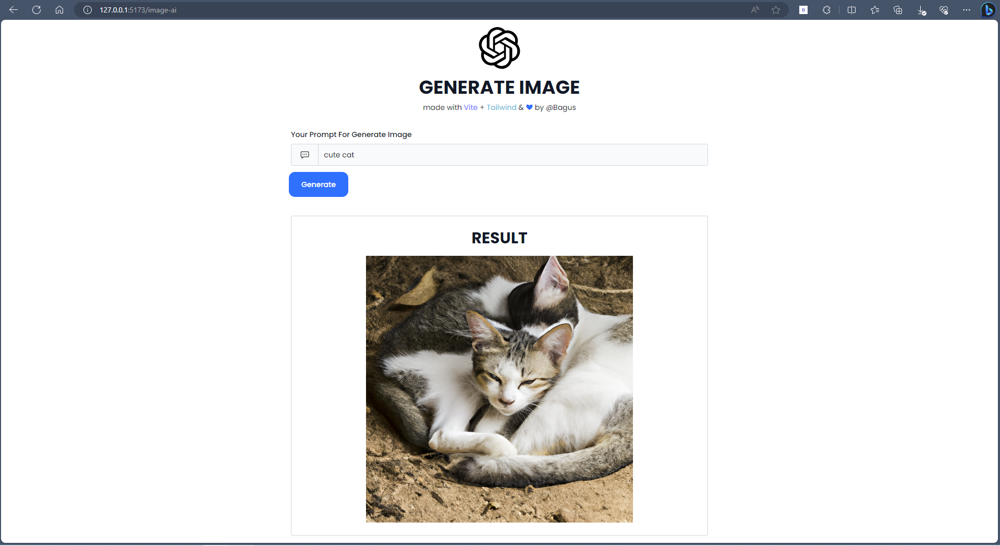

# Materi Installation OpenAI di React

## Resume Materi KMReact - Installation OpenAI di React

Poin penting yang dapat dipelajarin dari materi Installation OpenAI di React adalah

#### 1. Alasan menggunakan Open.AI

- Gratis (trial)
- Mudah dipasang
- Dipakai banyak user
- Jumlah parameter sekitar 175 miliar (model davinci 03)

#### 2. Install Open.AI di react

- buat project react -> npx create-react-app react-project
- install package openai -> npm install openai
- import module yang diperlukan -> import OpenAI from 'openai'
- melakukan konfigurasi seperti memasukkan api key yang didapatkan dari website openai

#### 3. API Keys

- buka situs web OpenAI di sini https://platform.openai.com/account/api-keys
- untuk mendapatkan API keys perlu memiliki account di OpenAI.com
- setelah masuk ke halaman api-keys, lakukan create new secret key
- api keys yang sudah dibuat dapat dicopy dan digunakan

---

## Task

#### Soal Prioritas 1

1. Buatlah sebuah halaman baru yang terdapat form input dan button submit
2. Hubungkan halaman tersebut dengan Open.ai sehingga ketika kita melakukan input akan dijawab oleh open.ai mode davinci 03
   Berikut model davinci 03 yang akan digunakan pada react. 
    
    
   Berikut contoh ketika saya melakukan prompt pada ai di react 
   

#### Soal Prioritas 2

1. Masukkan css atau interaksi lain yang menarik pada halaman sehingga mudah untuk digunakan
   Untuk CSS saya menggunakan Tailwind CSS.
2. Kalian boleh menambahkan fitur lain diluar dari soal dengan tujuan memudahkan user
   Berikut halaman utama yang akan tampil, user dapat memilih ai yang ingin digunakan seperti chat ai dan generate image 
    
   Pada generate image, user dapat melakukan generate image sesuai prompt yang diketik. 
   
