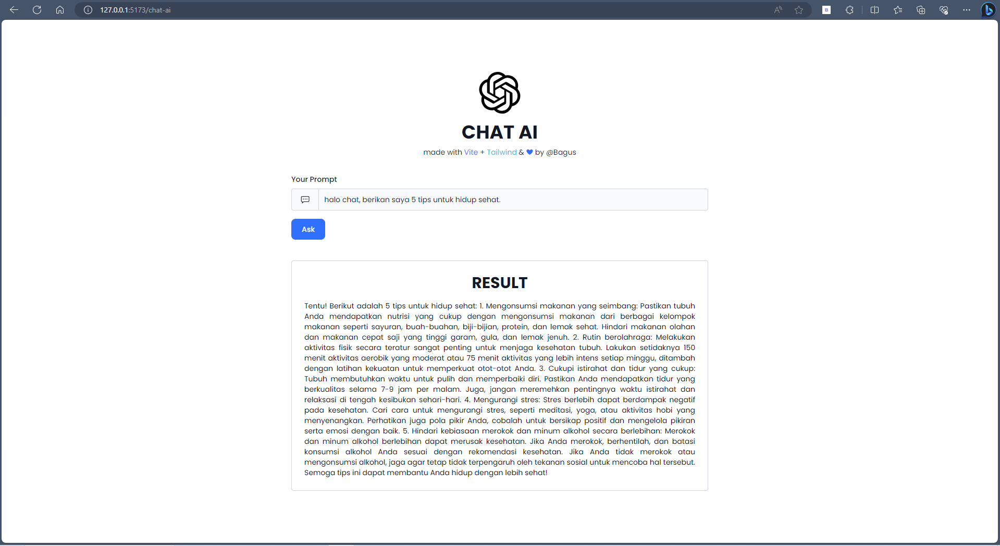
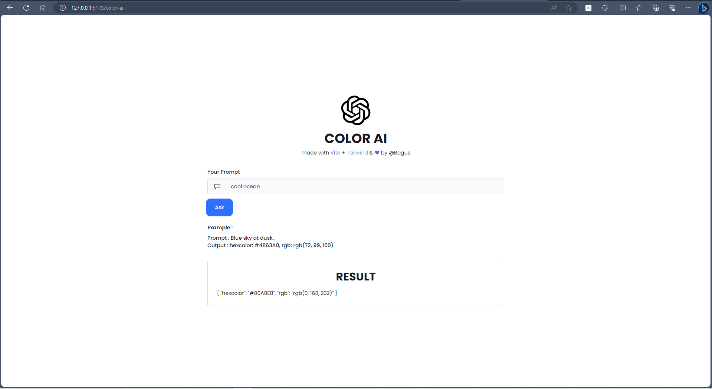
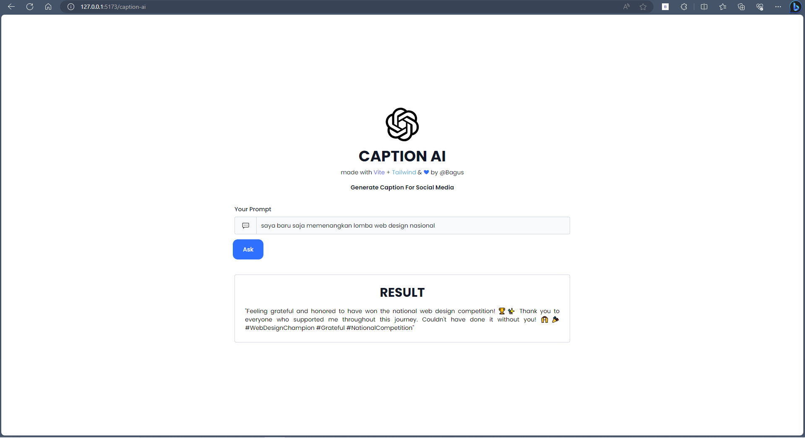

# Materi Basic Model OpenAI dan Prompt Engginer di React

## Resume Materi KMReact - Basic Model OpenAI dan Prompt Engginer di React

Poin penting yang dapat dipelajarin dari materi Basic Model OpenAI dan Prompt Engginer di React adalah

#### 1. Alasan Belajar Model OpenAI dan Prompt Engineer

- Meningkatkan penggunaan Model OpenAI
- Membangun Aplikasi AI yang lebih relevan
- Menjadi bagian dari komunitas AI
- Mengoptimalkan Output Model AI
- Meningkatkan daya saing di bidang AI

#### 2. Model OpenAI

Merupakan sebuah sistem kecedasan buatan (AI) yang dapat digunakan untuk mempelajari pola - pola dari data dan menghasilkan output yang sesuai dengan data yang diberikan.

#### 3. Prompt Engineer

Merupakan sebuah teknik yang digunakan untuk mengoptimalkan output dari model AI dengan memberikan prompt atau instruksi pada model tersebut. Prompt Enginner bisa dijadikan sebuah pekerjaan yang dimana memliki range salary sebesar $175000 - $335000.

---

## Task

#### Soal Prioritas 1

1. Pakai tugas yang telah menerapkan OpenAI API dan terapkan prompt sehingga dapat berfungsi khusus untuk melakukan Q&A (tema Q&A bebas)
   

#### Soal Prioritas 2

1. Buat halaman baru yang terhubung ke OpenAI API.
2. Cari ide menarik yang memanfaatkan API OpenAI.
   Saya memanfaatkan API keys dari OpenAI untuk membuat sebuah AI yang bisa melakukan generate hex color dan rgb color berdasarkan promt yang diberikan. 
   
3. Implementasikan ide tersebut menggunakan API OpenAI.
   Saya juga membuat AI yang bisa melakukan generate caption untuk postingan sosial media sesuai prompt yang diberikan. 
   
